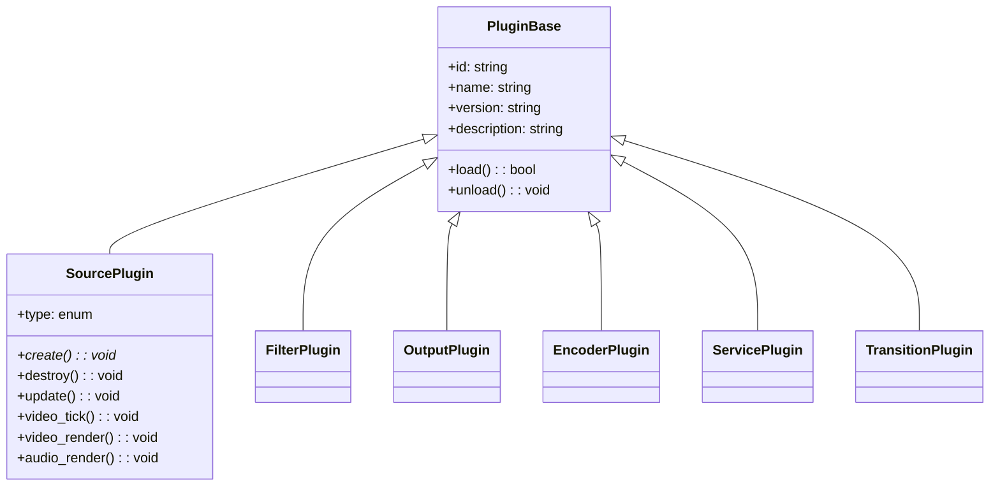
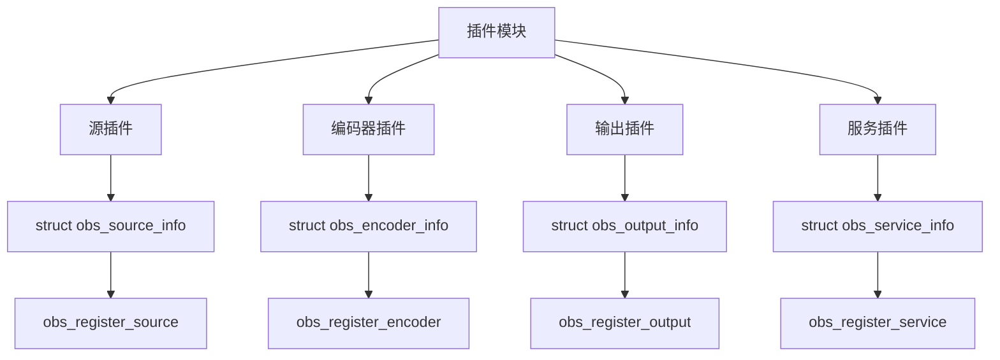

# OBS Studio插件架构分析报告

## 问题描述
在 `docs/study/arch/obs-studio-plugin-architecture-guide.md` 文档中，第506行包含了一个错误的Mermaid类图，声称存在 `PluginBase` 类及其子类（SourcePlugin、FilterPlugin、OutputPlugin等），但这些类在实际代码中并不存在。

## 根本原因分析

### 1. 文档与代码架构不匹配
- **文档描述**：C++ 类继承结构
- **实际代码**：C 语言函数接口和结构体

### 2. 错误的类层次结构图
文档中声称的类层次结构：


### 3. 实际情况
OBS Studio 插件架构实际基于：

#### 3.1 核心结构体
- `struct obs_source_info` - 源插件定义
- `struct obs_encoder_info` - 编码器插件定义  
- `struct obs_output_info` - 输出插件定义
- `struct obs_service_info` - 服务插件定义

#### 3.2 注册函数
- `obs_register_source()` - 注册源插件
- `obs_register_encoder()` - 注册编码器插件
- `obs_register_output()` - 注册输出插件
- `obs_register_service()` - 注册服务插件

#### 3.3 模块声明宏
```c
OBS_DECLARE_MODULE()
OBS_MODULE_USE_DEFAULT_LOCALE("module-name", "en-US")

bool obs_module_load(void)
{
    obs_register_source(&my_source);
    return true;
}
```

## 代码验证

### 搜索结果
通过搜索整个代码库确认：
1. **无 PluginBase 类定义**：
   - 搜索 "class.*PluginBase" - 无匹配
   - 搜索 "PluginBase" - 仅在文档中找到

2. **实际插件注册示例**（win-capture插件）：
```c
// plugin-main.c
bool obs_module_load(void)
{
    obs_register_source(&duplicator_capture_info);
    obs_register_source(&monitor_capture_info);
    obs_register_source(&window_capture_info);
    obs_register_source(&game_capture_info);
    return true;
}
```

3. **结构体定义示例**（libobs/obs-source.h）：
```c
struct obs_source_info {
    const char *id;
    const char *name;
    uint32_t type;
    uint32_t output_flags;
    void (*get_name)(struct obs_data_t *, const char *, struct obs_data_t *);
    void *(*create)(struct obs_data_t *, struct obs_source_t *);
    void (*destroy)(void *);
    // ... 更多回调函数
};
```

## 错误影响评估

### 高影响
1. **开发者误导**：开发者可能尝试继承不存在的基类
2. **实现困难**：无法找到期望的基类实现
3. **架构理解错误**：对OBS插件架构产生误解

### 中等影响
1. **文档可信度**：降低文档的可信度和准确性
2. **学习效率**：初学者可能被错误信息误导

## 修复建议

### 1. 立即修复（高优先级）
- 删除文档中错误的Mermaid类图
- 移除所有关于 PluginBase 类的引用
- 替换为正确的C语言架构说明

### 2. 内容替换
替换为正确的架构图表：



### 3. 文档改进
- 添加实际的代码示例
- 提供完整的插件开发指南
- 包含正确的API文档链接

## 结论

这是一个需要立即修复的文档错误。文档中的类层次结构图与实际代码架构完全不符，可能导致开发者的困惑。建议：

1. **立即修复**：删除错误的类图
2. **内容替换**：添加正确的架构说明
3. **文档审查**：建立文档与代码一致性检查机制

修复这个问题对于维护文档准确性和帮助开发者正确理解OBS Studio插件架构至关重要。