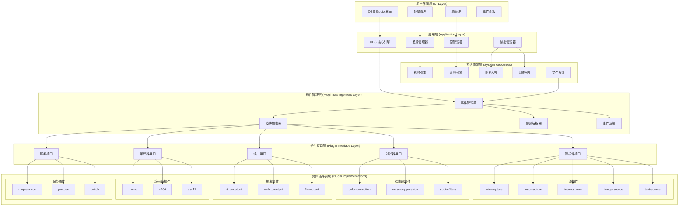
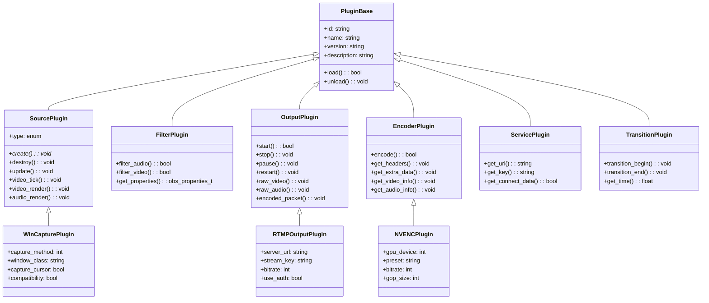
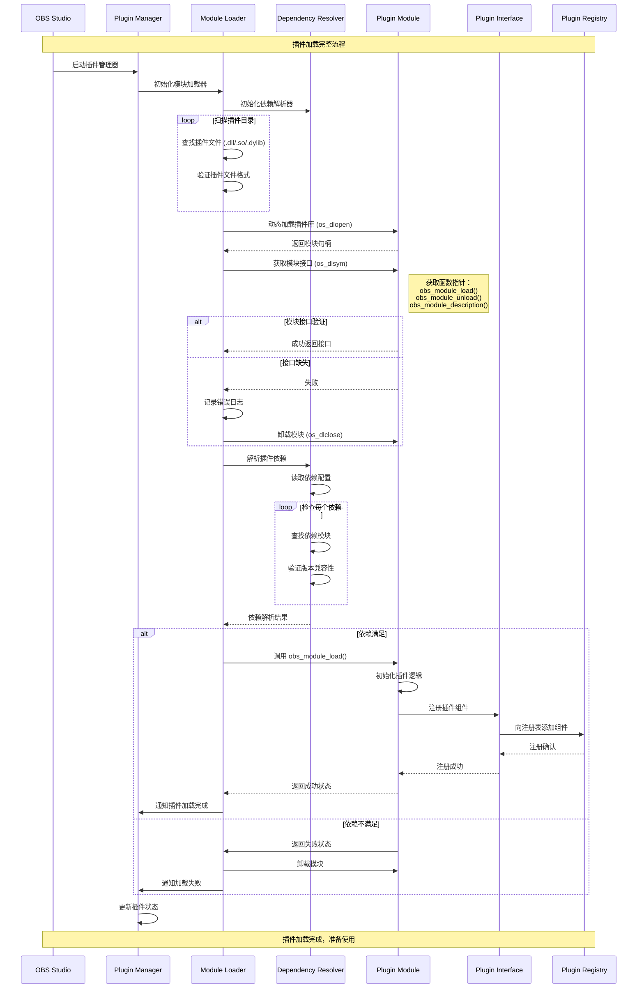
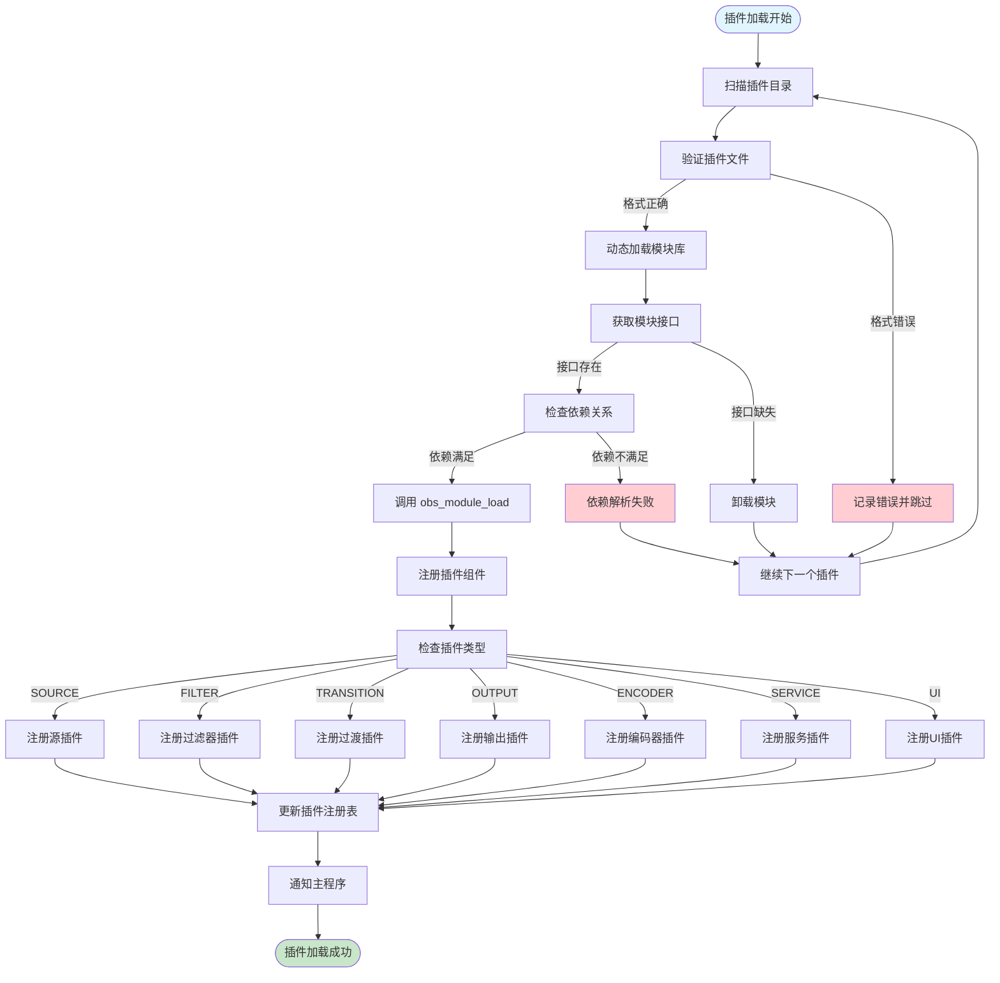
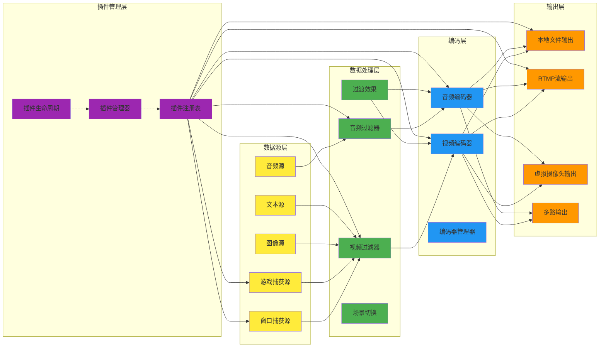
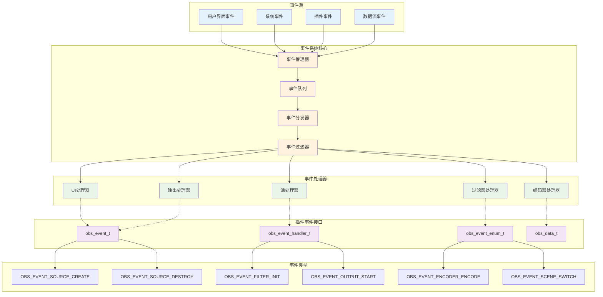
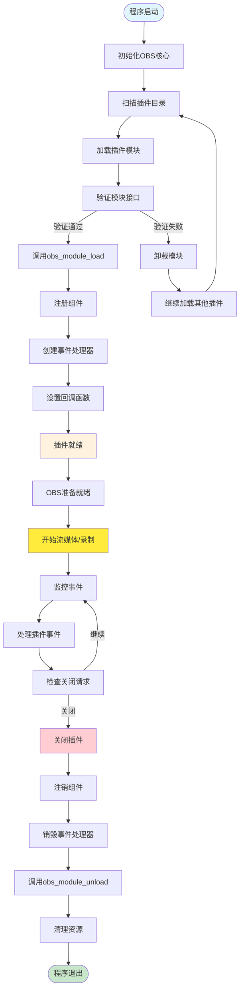
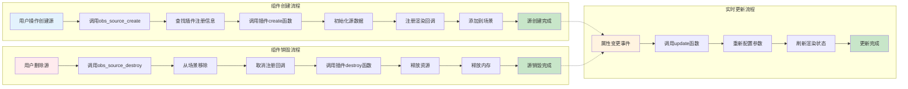

# OBS Studio 插件架构与开发指南

## 文档概述

本文档详细介绍了 OBS Studio 的插件架构设计和自定义插件开发方法。文档包含两部分核心内容：
1. **现有插件使用指南** - 涵盖各插件的安装、配置和使用方法
2. **插件开发架构** - 详细阐述插件注册流程、接口规范和生命周期管理

---

## 目录

- [第一部分：现有插件使用指南](#第一部分现有插件使用指南)
  - [1.1 插件安装与配置](#11-插件安装与配置)
  - [1.2 win-capture 插件详细使用指南](#12-win-capture-插件详细使用指南)
  - [1.3 音频处理插件](#13-音频处理插件)
  - [1.4 编码器插件](#14-编码器插件)
  - [1.5 输出服务插件](#15-输出服务插件)
- [第二部分：插件开发架构](#第二部分插件开发架构)
  - [2.1 系统架构概述](#21-系统架构概述)
  - [2.2 插件注册机制](#22-插件注册机制)
  - [2.3 插件接口规范](#23-插件接口规范)
  - [2.4 生命周期管理](#24-生命周期管理)
  - [2.5 自定义插件开发](#25-自定义插件开发)
  - [2.6 依赖注入与扩展点](#26-依赖注入与扩展点)
- [第三部分：开发实例与最佳实践](#第三部分开发实例与最佳实践)
  - [3.1 完整插件开发示例](#31-完整插件开发示例)
  - [3.2 调试与测试](#32-调试与测试)
  - [3.3 性能优化建议](#33-性能优化建议)

---

## 第一部分：现有插件使用指南

### 1.1 插件安装与配置

#### 1.1.1 自动安装（推荐）

OBS Studio 的插件通常通过以下方式自动安装：

```bash
# 通过包管理器安装
winget install OBSProject.OBSStudio

# 或者下载官方安装包，包含所有标准插件
```

#### 1.1.2 手动安装

手动安装插件需要将插件文件放置在正确目录：

**Windows 路径:**
```
C:\Program Files\obs-studio\data\obs-plugins\
%APPDATA%\obs-studio\basic\scenes\
```

**Linux 路径:**
```
/usr/share/obs/obs-plugins/
~/.config/obs-studio/basic/scenes/
```

**macOS 路径:**
```
/Applications/OBS.app/Contents/Resources/obs-plugins/
~/Library/Application Support/obs-studio/basic/scenes/
```

#### 1.1.3 插件验证

验证插件是否正确安装：

1. 打开 OBS Studio
2. 进入 `工具` → `插件信息`
3. 查看已加载插件列表
4. 确认插件状态为"已加载"

---

### 1.2 win-capture 插件详细使用指南

win-capture 插件是 OBS Studio 的核心插件之一，提供 Windows 平台下的屏幕和窗口捕获功能。

#### 1.2.1 插件功能概述

win-capture 插件提供以下捕获模式：

- **显示器捕获** - 捕获整个显示器内容
- **窗口捕获** - 捕获特定应用程序窗口
- **游戏捕获** - 专用游戏捕获模式，性能最优
- **壁纸捕获** - 捕获桌面壁纸（Windows 10/11）

#### 1.2.2 游戏捕获详细配置

游戏捕获是 win-capture 插件的核心功能，具有最佳的性能表现。

**基础配置步骤：**

1. **创建游戏捕获源**
   ```
   源 → + → 游戏捕获
   ```

2. **模式选择**
   - **捕获任何全屏应用程序** - 推荐，性能最佳
   - **捕获特定窗口** - 精确控制
   - **使用逐帧捕获** - 兼容性优先

3. **高级设置**
   ```c
   // 游戏捕获内部配置示例
   struct game_capture {
       bool use_hooks;           // 使用图形API钩子
       bool allow_safari;        // 允许Safari兼容性
       uint32_t timeout;         // 超时设置
       bool force_shmem;         // 强制共享内存
       bool copy_hint;           // 复制提示
   };
   ```

**性能优化配置：**

```ini
# 配置文件位置：%APPDATA%\obs-studio\basic\scenes\}
[GameCapture]
AntiCheatHook=true
HookRate=120
ForceGpuLoss=false
```

#### 1.2.3 窗口捕获配置

窗口捕获适用于需要精确控制捕获内容的场景。

**配置参数：**

```c
// 窗口捕获配置结构
struct window_capture {
    char *class_name;           // 窗口类名
    char *window_title;         // 窗口标题
    bool capture_cursor;        // 捕获鼠标光标
    bool capture_mode;          // 捕获模式
    int method;                 // 捕获方法
};
```

**窗口匹配规则：**

1. **精确匹配** - 窗口类名和标题完全匹配
2. **模糊匹配** - 包含关键词的窗口
3. **正则匹配** - 使用正则表达式

#### 1.2.4 故障排除

**常见问题及解决方案：**

1. **黑屏问题**
   - 检查游戏是否以管理员权限运行
   - 启用"兼容模式"选项
   - 尝试不同的捕获模式

2. **性能问题**
   - 使用游戏捕获替代窗口捕获
   - 降低捕获帧率
   - 禁用不必要的视觉效果

3. **权限问题**
   ```c
   // 权限检查函数示例
   static bool has_elevation(void)
   {
       // 检查管理员权限
       if (has_elevation_internal()) {
           // 有管理员权限，添加AAP权限
           add_aap_perms(directory_path);
       }
   }
   ```

---

### 1.3 音频处理插件

OBS Studio 提供多种音频处理插件，用于增强音频质量。

#### 1.3.1 音频输入插件

**Linux ALSA 插件 (`linux-alsa`)**

```c
// ALSA 插件配置示例
struct alsa_input {
    char *device;              // 音频设备名
    int channels;              // 音频通道数
    int sample_rate;           // 采样率
    int buffer_size;           // 缓冲区大小
};
```

**Windows WASAPI 插件 (`win-wasapi`)**

```c
// WASAPI 配置
struct wasapi_input {
    char *device_id;           // 设备ID
    bool exclusive;            // 独占模式
    int buffer_length;         // 缓冲区长度
};
```

#### 1.3.2 音频过滤器

**噪声抑制 (`rnnoise`)**

```c
// 噪声抑制配置
struct rnnoise_filter {
    float threshold;           // 噪声阈值
    int reduction_level;       // 降噪级别
    bool enable_agc;           // 启用自动增益控制
};
```

**回声消除 (`obs-filters`)**

```c
// 回声消除配置
struct echo_filter {
    int delay_ms;              // 延迟毫秒数
    float echo_mix;            // 回声混合比例
    bool enable_agc;           // 启用自动增益控制
};
```

#### 1.3.3 音频编码器

**FFmpeg AAC 编码器**

```c
// AAC 编码器配置
struct aac_encoder {
    int bitrate;               // 比特率
    int sample_rate;           // 采样率
    int channels;              // 通道数
    int quality;               // 质量级别
};
```

---

### 1.4 编码器插件

OBS Studio 支持多种视频编码器插件。

#### 1.4.1 硬件编码器

**NVIDIA NVENC (`obs-nvenc`)**

```c
// NVENC 配置结构
struct nvenc_info {
    int gpu;                   // GPU设备ID
    int preset;                // 编码预设
    int cbr;                   // 恒定比特率
    int vbr;                   // 可变比特率
    int cq;                    // 质量因子
};
```

**Intel Quick Sync (`obs-qsv11`)**

```c
// QSV 配置
struct qsv_info {
    int target_usage;          // 目标使用模式
    int rate_control;          // 速率控制
    int icq_quality;           // 质量控制
    int qpi;                   // I帧质量
};
```

#### 1.4.2 软件编码器

**x264 编码器 (`obs-x264`)**

```c
// x264 配置
struct x264_info {
    int bitrate;               // 比特率
    int keyint;                // 关键帧间隔
    int bframes;               // B帧数量
    char *preset;              // 编码预设
    char *tune;                // 调优参数
};
```

---

### 1.5 输出服务插件

#### 1.5.1 流媒体服务

**RTMP 输出 (`obs-outputs`)**

```c
// RTMP 输出配置
struct rtmp_output {
    char *server;              // 服务器URL
    char *key;                 // 推流密钥
    int bitrate;               // 比特率
    bool use_auth;             // 使用认证
};
```

**WebRTC 输出 (`obs-webrtc`)**

```c
// WebRTC 配置
struct webrtc_output {
    char *stun_server;         // STUN服务器
    char *turn_server;         // TURN服务器
    int video_bitrate;         // 视频比特率
    int audio_bitrate;         // 音频比特率
};
```

#### 1.5.2 文件输出

**MP4 输出 (`obs-outputs`)**

```c
// MP4 输出配置
struct mp4_output {
    char *path;                // 文件路径
    int video_bitrate;         // 视频比特率
    int audio_bitrate;         // 音频比特率
    char *encoder;             // 编码器
};
```

---

## 第二部分：插件开发架构

### 2.1 系统架构概述

OBS Studio 采用模块化插件架构，支持动态加载和热插拔功能。

#### 2.1.1 整体架构图



#### 2.1.2 核心组件说明

**OBS Core (核心引擎)**
- 提供基础的媒体处理功能
- 管理插件生命周期
- 处理模块间通信

**Plugin Manager (插件管理器)**
- 负责插件的加载和卸载
- 管理插件依赖关系
- 提供插件注册接口

**Plugin Interfaces (插件接口)**
- 定义标准的插件接口
- 实现类型安全的插件通信
- 提供扩展点机制

#### 2.1.3 插件分类体系

```c
// 插件类型定义
enum obs_plugin_type {
    OBS_PLUGIN_TYPE_SOURCE,    // 源插件 - 提供输入
    OBS_PLUGIN_TYPE_FILTER,    // 过滤器插件 - 处理数据
    OBS_PLUGIN_TYPE_TRANSITION,// 过渡插件 - 场景切换
    OBS_PLUGIN_TYPE_OUTPUT,    // 输出插件 - 输出数据
    OBS_PLUGIN_TYPE_ENCODER,   // 编码器插件 - 数据编码
    OBS_PLUGIN_TYPE_SERVICE,   // 服务插件 - 网络服务
    OBS_PLUGIN_TYPE_UI         // UI插件 - 用户界面
};
```

#### 2.1.4 插件类型层次结构图



---

### 2.2 插件注册机制

#### 2.2.1 插件加载时序图



OBS Studio 使用统一的插件注册机制来管理各种类型的插件。

#### 2.2.2 插件注册机制流程图



#### 2.2.3 数据流架构图



#### 2.2.1 插件模块结构

每个插件必须包含标准的入口函数和模块声明：

```c
// 插件模块声明
OBS_DECLARE_MODULE()

// 模块描述函数
MODULE_EXPORT const char *obs_module_description(void)
{
    return "Plugin Description";
}

// 模块路径函数
MODULE_EXPORT const char *obs_module_name(void)
{
    return "Plugin Name";
}

// 模块加载函数
bool obs_module_load(void)
{
    // 注册各种插件组件
    obs_register_source(&source_info);
    obs_register_output(&output_info);
    obs_register_encoder(&encoder_info);
    
    return true;
}
```

#### 2.2.2 源插件注册

源插件是最常见的插件类型，用于提供输入数据：

```c
// 源插件信息结构
struct obs_source_info {
    const char *id;                    // 唯一标识符
    const char *type;                  // 插件类型
    const char *output_name;           // 输出名称
    const char *icon;                  // 图标路径
    
    // 源创建和销毁
    void *(*create)(obs_data_t *settings, struct obs_source *source);
    void (*destroy)(void *data);
    
    // 源更新
    void (*update)(void *data, obs_data_t *settings);
    void (*get_defaults)(obs_data_t *settings);
    
    // 源属性
    obs_properties_t *(*get_properties)(void *data);
    void (*get_property_name)(void *data, const char *property, struct dstr *name);
    
    // 媒体处理
    void (*video_tick)(void *data, float seconds);
    void (*video_render)(void *data, gs_effect_t *effect);
    void (*audio_render)(void *data, uint64_t *ts_out, 
                        struct obs_audio_data *audio);
    
    // 过滤和过渡
    bool (*filter_audio)(void *data, struct obs_audio_data *audio);
    void (*transition_begin)(void *data, enum obs_transition_mode mode);
    void (*transition_end)(void *data);
};

// 注册源插件
void obs_register_source_s(const struct obs_source_info *info, size_t size);
#define obs_register_source(info) obs_register_source_s(info, sizeof(struct obs_source_info))
```

#### 2.2.3 编码器插件注册

编码器插件负责数据编码：

```c
// 编码器信息结构
struct obs_encoder_info {
    const char *id;                    // 编码器ID
    const char *type;                  // 编码器类型
    const char *codec;                 // 编码格式
    
    // 编码器创建
    void *(*create)(obs_data_t *settings, const char *name, 
                   void *hash, void *product);
    void (*destroy)(void *data);
    
    // 编码控制
    bool (*encode)(void *data, struct encoder_frame *frame, 
                   struct encoder_packet *packet, bool *received_packet);
    void (*get_headers)(void *data, uint8_t **header, size_t *size);
    void (*get_sei_data)(void *data, uint8_t **sei, size_t *size);
    
    // 编码器信息
    void (*get_extra_data)(void *data, uint8_t **extra_data, size_t *size);
    void (*get_video_info)(void *data, struct video_scale_info *info);
    void (*get_audio_info)(void *data, struct audio_convert_info *info);
    
    // 编码器控制
    void (*get_defaults)(obs_data_t *settings);
    obs_properties_t *(*get_properties)(void *data);
    bool (*get_name_info)(const char **name, uint64_t *hash, void *data);
};
```

#### 2.2.4 输出插件注册

输出插件处理数据输出：

```c
// 输出插件信息结构
struct obs_output_info {
    const char *id;                    // 输出ID
    const char *output_name;           // 输出名称
    const char *caps;                  // 输出能力
    
    // 输出创建
    void *(*create)(obs_data_t *settings, struct obs_output *output);
    void (*destroy)(void *data);
    
    // 输出控制
    bool (*start)(void *data);
    void (*stop)(void *data, uint64_t ts);
    void (*pause)(void *data);
    void (*restart)(void *data);
    
    // 数据处理
    void (*raw_video)(void *data, const struct video_data *frame);
    void (*raw_audio)(void *data, const struct audio_data *frame);
    
    // 编码数据
    void (*encoded_packet)(void *data, struct encoder_packet *packet);
    
    // 属性和默认值
    void (*get_defaults)(obs_data_t *settings);
    obs_properties_t *(*get_properties)(void *data);
};
```

---

### 2.3 插件接口规范

#### 2.3.1 事件系统架构图



#### 2.3.2 插件生命周期流程图



#### 2.3.3 组件创建与销毁流程图



OBS Studio 定义了严格的插件接口规范，确保插件之间的兼容性。

#### 2.3.1 内存管理规范

插件必须遵循 OBS 的内存管理规则：

```c
// 内存分配 - 使用 OBS 提供的函数
void *plugin_malloc(size_t size)        // 内存分配
void plugin_free(void *ptr)             // 内存释放
void *plugin_realloc(void *ptr, size_t size) // 内存重分配

// 字符串处理
char *plugin_strdup(const char *str)    // 字符串复制
wchar_t *plugin_wcsdup(const wchar_t *str) // 宽字符串复制

// 数组管理
void plugin_array_reserve(void **array, size_t *capacity, size_t elem_size, size_t desired)
// 示例：扩展字符串数组
plugin_array_reserve((void **)&str_array, &array_capacity, sizeof(char*), new_size);
```

#### 2.3.2 数据类型规范

**基础数据类型**

```c
// 基础数据类型定义
typedef int32_t int32;
typedef int64_t int64;
typedef uint32_t uint32;
typedef uint64_t uint64;
typedef bool boolean;

// 固定精度类型
typedef float float32;
typedef double float64;

// 平台相关类型
typedef unsigned long ulong;
typedef unsigned int uint;
typedef unsigned short ushort;
```

**复杂数据结构**

```c
// 视频数据结构
struct video_data {
    uint32_t width;                     // 宽度
    uint32_t height;                    // 高度
    uint32_t format;                    // 像素格式
    uint64_t timestamp;                 // 时间戳
    uint8_t *data[8];                   // 平面数据指针
    uint32_t linesize[8];               // 行大小
};

// 音频数据结构
struct audio_data {
    uint32_t frames;                    // 帧数
    uint32_t samples_per_sec;           // 采样率
    uint32_t speakers;                  // 声道数
    uint32_t format;                    // 音频格式
    uint64_t timestamp;                 // 时间戳
    float32_t *data[MAX_AV_PLANES];     // 音频平面
};

// 编码数据包
struct encoder_packet {
    const uint8_t *data;                // 数据指针
    size_t size;                        // 数据大小
    uint64_t pts;                       // 显示时间戳
    uint64_t dts;                       // 解码时间戳
    bool keyframe;                      // 是否关键帧
    int type;                           // 数据类型
};
```

#### 2.3.3 回调函数规范

**源插件回调函数**

```c
// 源创建回调
typedef void *(*obs_source_create_t)(obs_data_t *settings, 
                                    struct obs_source *source);

// 源销毁回调
typedef void (*obs_source_destroy_t)(void *data);

// 源更新回调
typedef void (*obs_source_update_t)(void *data, obs_data_t *settings);

// 视频渲染回调
typedef void (*obs_source_video_render_t)(void *data, gs_effect_t *effect);

// 音频渲染回调
typedef void (*obs_source_audio_render_t)(void *data, uint64_t *ts_out,
                                         struct obs_audio_data *audio);
```

#### 2.3.4 错误处理规范

```c
// 错误代码定义
enum obs_error {
    OBS_ERROR_SUCCESS,                  // 成功
    OBS_ERROR_NOT_FOUND,                // 未找到
    OBS_ERROR_INVALID_PARAM,            // 无效参数
    OBS_ERROR_MODULE_NOT_FOUND,         // 模块未找到
    OBS_ERROR_FUNCTION_NOT_FOUND,       // 函数未找到
    OBS_ERROR_MODULE_LOAD_FAILED,       // 模块加载失败
    OBS_ERROR_VERSION_MISMATCH          // 版本不匹配
};

// 错误处理宏
#define blog(level, format, ...) \
    do { \
        if (level <= LOG_ERROR) { \
            char blog_buf[4096]; \
            snprintf(blog_buf, sizeof(blog_buf), format, ##__VA_ARGS__); \
            obs_log(level, blog_buf); \
        } \
    } while(false)

// 使用示例
bool plugin_init(void)
{
    if (!initialize_video_subsystem()) {
        blog(LOG_ERROR, "Failed to initialize video subsystem");
        return false;
    }
    
    return true;
}
```

---

### 2.4 生命周期管理

OBS Studio 对插件的生命周期进行严格管理，确保资源正确分配和释放。

#### 2.4.1 插件加载流程

```c
// 插件加载状态机
enum plugin_load_state {
    PLUGIN_LOAD_UNLOADED,               // 未加载
    PLUGIN_LOAD_REQUESTED,              // 请求加载
    PLUGIN_LOADING,                     // 加载中
    PLUGIN_LOADED,                      // 已加载
    PLUGIN_LOAD_FAILED,                 // 加载失败
    PLUGIN_UNLOAD_REQUESTED,            // 请求卸载
    PLUGIN_UNLOADING                    // 卸载中
};

// 插件加载流程
bool load_plugin(struct obs_module *module)
{
    // 1. 验证插件文件
    if (!verify_plugin_file(module->file_path)) {
        blog(LOG_ERROR, "Invalid plugin file: %s", module->file_path);
        return false;
    }
    
    // 2. 解析插件依赖
    if (!resolve_dependencies(module)) {
        blog(LOG_ERROR, "Failed to resolve dependencies for: %s", module->name);
        return false;
    }
    
    // 3. 加载插件模块
    module->module = os_dlopen(module->file_path);
    if (!module->module) {
        blog(LOG_ERROR, "Failed to load module: %s", module->file_path);
        return false;
    }
    
    // 4. 获取模块接口
    module->get_module_info = os_dlsym(module->module, "get_module_info");
    module->obs_module_load = os_dlsym(module->module, "obs_module_load");
    module->obs_module_unload = os_dlsym(module->module, "obs_module_unload");
    
    if (!module->obs_module_load) {
        blog(LOG_ERROR, "Module missing required function: obs_module_load");
        return false;
    }
    
    // 5. 调用模块加载函数
    if (!module->obs_module_load()) {
        blog(LOG_ERROR, "Module initialization failed: %s", module->name);
        return false;
    }
    
    module->load_state = PLUGIN_LOADED;
    return true;
}
```

#### 2.4.2 插件卸载流程

```c
// 插件卸载流程
bool unload_plugin(struct obs_module *module)
{
    if (module->load_state != PLUGIN_LOADED) {
        return false;
    }
    
    module->load_state = PLUGIN_UNLOAD_REQUESTED;
    
    // 1. 调用模块卸载函数
    if (module->obs_module_unload) {
        module->obs_module_unload();
    }
    
    // 2. 清理注册的组件
    unregister_module_components(module);
    
    // 3. 释放模块资源
    if (module->module) {
        os_dlclose(module->module);
        module->module = NULL;
    }
    
    // 4. 清理模块数据
    bfree(module->name);
    bfree(module->file_path);
    da_free(module->sources);
    da_free(module->outputs);
    da_free(module->encoders);
    
    module->load_state = PLUGIN_LOAD_UNLOADED;
    return true;
}

// 组件注销函数
static void unregister_module_components(struct obs_module *module)
{
    // 注销源
    for (size_t i = 0; i < module->sources.num; i++) {
        char *source_id = module->sources.array[i];
        obs_remove_source(source_id);
    }
    
    // 注销输出
    for (size_t i = 0; i < module->outputs.num; i++) {
        char *output_id = module->outputs.array[i];
        obs_remove_output(output_id);
    }
    
    // 注销编码器
    for (size_t i = 0; i < module->encoders.num; i++) {
        char *encoder_id = module->encoders.array[i];
        obs_remove_encoder(encoder_id);
    }
}
```

#### 2.4.3 热插拔支持

OBS Studio 支持插件的热插拔，允许在运行时加载和卸载插件：

```c
// 热插拔管理器
struct hotplug_manager {
    pthread_mutex_t mutex;
    struct da_watchers watchers;
    bool active;
};

// 插件变更监听器
typedef void (*plugin_watcher_callback)(const char *path, 
                                       enum os_watcher_event event, 
                                       void *data);

struct plugin_watcher {
    char *path;
    plugin_watcher_callback callback;
    void *data;
    struct os_watcher *watcher;
};

// 添加插件监听器
bool add_plugin_watcher(const char *path, plugin_watcher_callback callback, 
                       void *data)
{
    struct plugin_watcher *watcher = bzalloc(sizeof(*watcher));
    watcher->path = bstrdup(path);
    watcher->callback = callback;
    watcher->data = data;
    
    watcher->watcher = os_watcher_create(path, handle_plugin_event, watcher);
    if (!watcher->watcher) {
        bfree(watcher->path);
        bfree(watcher);
        return false;
    }
    
    da_push_back(hotplug_manager.watchers, watcher);
    return true;
}

// 处理插件事件
static void handle_plugin_event(const char *path, enum os_watcher_event event, 
                               void *data)
{
    struct plugin_watcher *watcher = data;
    
    switch (event) {
        case OS_WATCHER_EVENT_CREATED:
            if (is_plugin_file(path)) {
                watcher->callback(path, event, watcher->data);
            }
            break;
            
        case OS_WATCHER_EVENT_DELETED:
            watcher->callback(path, event, watcher->data);
            break;
            
        case OS_WATCHER_EVENT_MODIFIED:
            if (is_plugin_file(path)) {
                watcher->callback(path, event, watcher->data);
            }
            break;
    }
}
```

#### 2.4.4 依赖管理

```c
// 插件依赖结构
struct plugin_dependency {
    char *name;                         // 依赖名称
    char *version;                      // 依赖版本
    bool optional;                      // 是否可选
    struct obs_module *module;          // 依赖模块指针
};

// 依赖解析器
bool resolve_plugin_dependencies(struct obs_module *module)
{
    struct obs_data_array *deps = obs_data_get_array(module->settings, "dependencies");
    size_t count = obs_data_array_count(deps);
    
    for (size_t i = 0; i < count; i++) {
        struct obs_data *dep_data = obs_data_array_item(deps, i);
        
        struct plugin_dependency *dep = bzalloc(sizeof(*dep));
        dep->name = obs_data_get_string(dep_data, "name");
        dep->version = obs_data_get_string(dep_data, "version");
        dep->optional = obs_data_get_bool(dep_data, "optional");
        
        // 查找依赖模块
        dep->module = find_module_by_name(dep->name);
        if (!dep->module && !dep->optional) {
            blog(LOG_ERROR, "Required dependency not found: %s", dep->name);
            bfree(dep);
            obs_data_release(dep_data);
            return false;
        }
        
        // 检查版本兼容性
        if (dep->module && !check_version_compatibility(dep->module, dep->version)) {
            blog(LOG_ERROR, "Version mismatch for dependency: %s", dep->name);
            if (!dep->optional) {
                bfree(dep);
                obs_data_release(dep_data);
                return false;
            }
        }
        
        da_push_back(module->dependencies, dep);
        obs_data_release(dep_data);
    }
    
    obs_data_array_release(deps);
    return true;
}
```

---

### 2.5 自定义插件开发

本节详细介绍如何开发自定义 OBS Studio 插件。

#### 2.5.1 插件开发环境设置

**1. 创建插件项目结构**

```
my-plugin/
├── CMakeLists.txt                    # CMake 构建配置
├── plugin-main.c                     # 插件主入口
├── my-source.c                       # 源插件实现
├── my-source.h                       # 源插件头文件
├── my-filter.c                       # 过滤器插件实现
├── my-filter.h                       # 过滤器插件头文件
├── data/                             # 插件数据目录
│   └── locale/                       # 本地化文件
│       └── en-US.ini
└── README.md                         # 插件说明文档
```

**2. CMake 配置模板**

```cmake
cmake_minimum_required(VERSION 3.28...3.30)

project(my-plugin)

# 查找 OBS 库
find_package(libobs REQUIRED)

# 创建插件库
add_library(my-plugin MODULE)
target_link_libraries(my-plugin PRIVATE libobs)

# 设置插件属性
set_target_properties(my-plugin PROPERTIES
    PREFIX ""
    SUFFIX ".dll"
    RUNTIME_OUTPUT_DIRECTORY "${CMAKE_BINARY_DIR}/rundir/obs-plugins/${CMAKE_PROJECT_NAME}/"
)

# 源文件
target_sources(my-plugin PRIVATE
    plugin-main.c
    my-source.c
    my-filter.c
)

# 包含目录
target_include_directories(my-plugin PRIVATE
    ${CMAKE_CURRENT_SOURCE_DIR}
)

# 本地化数据
install(FILES data/locale/en-US.ini
        DESTINATION "data/obs-plugins/${CMAKE_PROJECT_NAME}/locale/")
```

#### 2.5.2 源插件开发示例

创建一个自定义的源插件：

**1. 源插件头文件 (my-source.h)**

```c
#pragma once

#include <obs-module.h>

// 源插件数据
struct my_source_data {
    obs_source_t *source;              // OBS 源指针
    uint32_t width;                    // 宽度
    uint32_t height;                   // 高度
    uint32_t *pixels;                  // 像素数据
    
    // 渲染相关
    gs_texture_t *texture;             // 纹理
    bool textures_valid;               // 纹理是否有效
};

// 源插件信息
extern struct obs_source_info my_source_info;
```

**2. 源插件实现 (my-source.c)**

```c
#include "my-source.h"

// 默认设置
static void get_defaults(obs_data_t *settings)
{
    obs_data_set_default_int(settings, "width", 1920);
    obs_data_set_default_int(settings, "height", 1080);
    obs_data_set_default_int(settings, "fps", 30);
    obs_data_set_default_string(settings, "format", "RGBA");
}

// 属性配置
static obs_properties_t *get_properties(void *data)
{
    obs_properties_t *props = obs_properties_create();
    
    obs_properties_add_int(props, "width", 
                          obs_module_text("Width"), 
                          320, 3840, 1);
    obs_properties_add_int(props, "height", 
                          obs_module_text("Height"), 
                          240, 2160, 1);
    obs_properties_add_int(props, "fps", 
                          obs_module_text("Frame Rate"), 
                          1, 120, 1);
    obs_properties_add_list(props, "format", 
                           obs_module_text("Format"),
                           OBS_COMBO_TYPE_LIST,
                           OBS_COMBO_FORMAT_STRING);
    obs_property_list_add_string(props, "RGBA", "RGBA");
    obs_property_list_add_string(props, "YUV", "YUV");
    obs_property_list_add_string(props, "NV12", "NV12");
    
    return props;
}

// 创建源
static void *create(obs_data_t *settings, obs_source_t *source)
{
    struct my_source_data *data = bzalloc(sizeof(*data));
    data->source = source;
    
    // 读取设置
    data->width = (uint32_t)obs_data_get_int(settings, "width");
    data->height = (uint32_t)obs_data_get_int(settings, "height");
    
    // 分配像素缓冲区
    data->pixels = bmalloc(data->width * data->height * 4);
    memset(data->pixels, 0, data->width * data->height * 4);
    
    return data;
}

// 销毁源
static void destroy(void *data)
{
    struct my_source_data *source_data = data;
    
    if (source_data->texture) {
        gs_texture_destroy(source_data->texture);
    }
    
    bfree(source_data->pixels);
    bfree(source_data);
}

// 更新设置
static void update(void *data, obs_data_t *settings)
{
    struct my_source_data *source_data = data;
    uint32_t new_width = (uint32_t)obs_data_get_int(settings, "width");
    uint32_t new_height = (uint32_t)obs_data_get_int(settings, "height");
    
    // 检查是否需要重新分配缓冲区
    if (new_width != source_data->width || new_height != source_data->height) {
        source_data->width = new_width;
        source_data->height = new_height;
        
        // 重新分配像素缓冲区
        bfree(source_data->pixels);
        source_data->pixels = bmalloc(new_width * new_height * 4);
        
        // 销毁旧纹理
        if (source_data->texture) {
            gs_texture_destroy(source_data->texture);
            source_data->texture = NULL;
        }
        
        source_data->textures_valid = false;
    }
}

// 视频渲染
static void video_render(void *data, gs_effect_t *effect)
{
    struct my_source_data *source_data = data;
    
    if (!source_data->textures_valid) {
        // 创建新纹理
        source_data->texture = gs_texture_create(
            source_data->width, 
            source_data->height, 
            GS_BGRA, 1, 
            (const uint8_t **)&source_data->pixels, 
            GS_DYNAMIC
        );
        source_data->textures_valid = true;
    } else {
        // 更新纹理数据
        gs_texture_set_image(source_data->texture, 
                           source_data->pixels, 
                           source_data->width * 4, 
                           false);
    }
    
    if (source_data->texture) {
        gs_effect_set_texture(gs_effect_get_param_by_name(effect, "image"), 
                            source_data->texture);
        gs_draw_sprite(source_data->texture, 0, 
                      source_data->width, 
                      source_data->height);
    }
}

// 视频 ticking
static void video_tick(void *data, float seconds)
{
    struct my_source_data *source_data = data;
    
    // 更新像素数据（示例：渐变色）
    uint32_t color = (uint32_t)(sinf(seconds * 2.0f) * 127.0f + 128.0f);
    for (uint32_t y = 0; y < source_data->height; y++) {
        for (uint32_t x = 0; x < source_data->width; x++) {
            uint32_t index = (y * source_data->width + x) * 4;
            source_data->pixels[index + 0] = color;        // B
            source_data->pixels[index + 1] = 255 - color;  // G
            source_data->pixels[index + 2] = x % 255;      // R
            source_data->pixels[index + 3] = 255;          // A
        }
    }
}

// 源插件信息结构
struct obs_source_info my_source_info = {
    .id = "my_custom_source",
    .type = OBS_SOURCE_TYPE_INPUT,
    .output_flags = OBS_SOURCE_VIDEO,
    .get_name = [](void *) { return obs_module_text("My Custom Source"); },
    .create = create,
    .destroy = destroy,
    .update = update,
    .get_defaults = get_defaults,
    .get_properties = get_properties,
    .video_tick = video_tick,
    .video_render = video_render,
};
```

#### 2.5.3 过滤器插件开发

创建自定义过滤器插件：

**1. 过滤器实现 (my-filter.c)**

```c
#include "my-filter.h"

// 过滤器数据
struct my_filter_data {
    obs_source_t *context;             // 源上下文
    float threshold;                   // 阈值
    bool invert;                       // 反转
    
    // 临时缓冲区
    uint8_t *temp_buffer;
    size_t temp_size;
};

// 过滤器处理函数
static struct obs_audio_data *filter_audio(void *data, 
                                          struct obs_audio_data *audio)
{
    struct my_filter_data *filter_data = data;
    
    if (!audio || !audio->data[0]) {
        return audio;
    }
    
    size_t sample_count = audio->frames * audio->speakers;
    if (filter_data->temp_size < sample_count * sizeof(float)) {
        bfree(filter_data->temp_buffer);
        filter_data->temp_buffer = bmalloc(sample_count * sizeof(float));
        filter_data->temp_size = sample_count * sizeof(float);
    }
    
    // 应用阈值过滤
    float *temp = (float *)filter_data->temp_buffer;
    for (size_t i = 0; i < sample_count; i++) {
        float sample = audio->data[0][i];
        
        if (filter_data->invert) {
            // 反转模式：保留低于阈值的声音
            temp[i] = (fabsf(sample) < filter_data->threshold) ? sample : 0.0f;
        } else {
            // 正常模式：保留高于阈值的声音
            temp[i] = (fabsf(sample) >= filter_data->threshold) ? sample : 0.0f;
        }
    }
    
    // 复制过滤后的数据
    memcpy(audio->data[0], temp, sample_count * sizeof(float));
    
    return audio;
}

// 创建过滤器
static void *create(obs_data_t *settings, obs_source_t *context)
{
    struct my_filter_data *data = bzalloc(sizeof(*data));
    data->context = context;
    data->threshold = (float)obs_data_get_double(settings, "threshold");
    data->invert = obs_data_get_bool(settings, "invert");
    
    return data;
}

// 销毁过滤器
static void destroy(void *data)
{
    struct my_filter_data *filter_data = data;
    
    bfree(filter_data->temp_buffer);
    bfree(filter_data);
}

// 更新设置
static void update(void *data, obs_data_t *settings)
{
    struct my_filter_data *filter_data = data;
    filter_data->threshold = (float)obs_data_get_double(settings, "threshold");
    filter_data->invert = obs_data_get_bool(settings, "invert");
}

// 默认设置
static void get_defaults(obs_data_t *settings)
{
    obs_data_set_default_double(settings, "threshold", 0.1);
    obs_data_set_default_bool(settings, "invert", false);
}

// 属性配置
static obs_properties_t *get_properties(void *data)
{
    obs_properties_t *props = obs_properties_create();
    
    obs_properties_add_float_slider(props, "threshold", 
                                   obs_module_text("Threshold"), 
                                   0.0, 1.0, 0.01);
    obs_properties_add_bool(props, "invert", 
                           obs_module_text("Invert (keep quiet sounds)"));
    
    return props;
}

// 过滤器信息结构
struct obs_source_info my_filter_info = {
    .id = "my_audio_filter",
    .type = OBS_SOURCE_TYPE_FILTER,
    .output_flags = OBS_SOURCE_AUDIO,
    .get_name = [](void *) { return obs_module_text("My Audio Filter"); },
    .create = create,
    .destroy = destroy,
    .update = update,
    .get_defaults = get_defaults,
    .get_properties = get_properties,
    .filter_audio = filter_audio,
};
```

#### 2.5.4 插件主入口

**插件主入口文件 (plugin-main.c)**

```c
#include <obs-module.h>

// 声明插件组件
extern struct obs_source_info my_source_info;
extern struct obs_source_info my_filter_info;

// 插件描述
MODULE_EXPORT const char *obs_module_description(void)
{
    return "My Custom Plugin - Demo plugin showing OBS plugin development";
}

// 模块加载
bool obs_module_load(void)
{
    // 注册源插件
    obs_register_source(&my_source_info);
    
    // 注册过滤器插件
    obs_register_source(&my_filter_info);
    
    blog(LOG_INFO, "Plugin loaded successfully");
    return true;
}

// 模块卸载
void obs_module_unload(void)
{
    blog(LOG_INFO, "Plugin unloaded");
}
```

---

### 2.6 依赖注入与扩展点

OBS Studio 提供了完善的依赖注入机制和扩展点设计。

#### 2.6.1 核心服务接口

```c
// 核心服务接口定义
struct obs_core_service {
    // 日志服务
    void (*log)(enum obs_log_level level, const char *format, ...);
    
    // 内存管理
    void* (*malloc)(size_t size);
    void (*free)(void *ptr);
    char* (*strdup)(const char *str);
    
    // 线程服务
    pthread_t (*thread_create)(void *(*func)(void*), void *arg);
    void (*thread_join)(pthread_t thread);
    
    // 定时器服务
    struct os_timer* (*timer_add)(void (*callback)(void*), void *data, 
                                 uint32_t interval_ms);
    void (*timer_remove)(struct os_timer *timer);
    
    // 网络服务
    struct http_request* (*http_create)(const char *url);
    void (*http_set_method)(struct http_request *request, const char *method);
    void (*http_set_header)(struct http_request *request, 
                           const char *key, const char *value);
    int (*http_execute)(struct http_request *request, long timeout_ms);
    void (*http_destroy)(struct http_request *request);
    
    // 文件服务
    struct os_file* (*file_open)(const char *path, const char *mode);
    size_t (*file_read)(struct os_file *file, void *buffer, size_t size);
    size_t (*file_write)(struct os_file *file, const void *buffer, size_t size);
    bool (*file_close)(struct os_file *file);
    
    // 音频服务
    struct obs_audio_info (*get_audio_info)(void);
    void (*set_audio_info)(struct obs_audio_info *info);
    
    // 视频服务
    struct obs_video_info (*get_video_info)(void);
    void (*set_video_info)(struct obs_video_info *info);
};

// 全局服务接口
extern struct obs_core_service *obs;
```

#### 2.6.2 服务注入机制

```c
// 服务注册表
struct service_registry {
    pthread_mutex_t mutex;
    struct hash_table services;
};

static struct service_registry *global_registry = NULL;

// 服务接口定义
struct service_interface {
    const char *name;                   // 服务名称
    const char *version;                // 服务版本
    void *implementation;               // 服务实现
    void (*destroy)(void *implementation); // 销毁函数
};

// 注册服务
bool obs_register_service(const char *name, const char *version, 
                         void *implementation, void (*destroy)(void*))
{
    if (!global_registry) {
        global_registry = bmalloc(sizeof(*global_registry));
        pthread_mutex_init(&global_registry->mutex, NULL);
        hash_table_init(&global_registry->services, 
                       hash_string_func, compare_string_func);
    }
    
    pthread_mutex_lock(&global_registry->mutex);
    
    // 检查服务是否已存在
    struct service_interface *existing = 
        hash_table_get(&global_registry->services, name);
    if (existing) {
        blog(LOG_WARNING, "Service already registered: %s", name);
        pthread_mutex_unlock(&global_registry->mutex);
        return false;
    }
    
    // 创建服务接口
    struct service_interface *service = bmalloc(sizeof(*service));
    service->name = bstrdup(name);
    service->version = bstrdup(version);
    service->implementation = implementation;
    service->destroy = destroy;
    
    // 注册服务
    hash_table_insert(&global_registry->services, name, service);
    
    pthread_mutex_unlock(&global_registry->mutex);
    
    blog(LOG_INFO, "Service registered: %s v%s", name, version);
    return true;
}

// 获取服务
void* obs_get_service(const char *name)
{
    if (!global_registry) {
        return NULL;
    }
    
    pthread_mutex_lock(&global_registry->mutex);
    
    struct service_interface *service = 
        hash_table_get(&global_registry->services, name);
    void *implementation = service ? service->implementation : NULL;
    
    pthread_mutex_unlock(&global_registry->mutex);
    
    return implementation;
}
```

#### 2.6.3 扩展点设计

**1. 过滤器扩展点**

```c
// 过滤器扩展点管理器
struct filter_extension_point {
    const char *filter_id;              // 过滤器ID
    void (*apply_filter)(void *filter_data, struct obs_audio_data *audio);
    void (*get_properties)(void *filter_data, obs_properties_t *props);
    void (*update_settings)(void *filter_data, obs_data_t *settings);
};

// 扩展点管理器
struct extension_manager {
    pthread_mutex_t mutex;
    struct da_filter_extensions extensions;
};

static struct extension_manager *filter_extensions = NULL;

// 注册过滤器扩展
bool obs_register_filter_extension(const char *filter_id, 
                                  void (*apply_filter)(void*, struct obs_audio_data*),
                                  void (*get_properties)(void*, obs_properties_t*),
                                  void (*update_settings)(void*, obs_data_t*))
{
    if (!filter_extensions) {
        filter_extensions = bmalloc(sizeof(*filter_extensions));
        pthread_mutex_init(&filter_extensions->mutex, NULL);
        da_init(filter_extensions->extensions);
    }
    
    struct filter_extension_point *ext = bmalloc(sizeof(*ext));
    ext->filter_id = bstrdup(filter_id);
    ext->apply_filter = apply_filter;
    ext->get_properties = get_properties;
    ext->update_settings = update_settings;
    
    pthread_mutex_lock(&filter_extensions->mutex);
    da_push_back(filter_extensions->extensions, ext);
    pthread_mutex_unlock(&filter_extensions->mutex);
    
    return true;
}

// 应用过滤器扩展
void apply_filter_extensions(const char *filter_id, void *filter_data, 
                            struct obs_audio_data *audio)
{
    if (!filter_extensions) {
        return;
    }
    
    pthread_mutex_lock(&filter_extensions->mutex);
    
    for (size_t i = 0; i < filter_extensions->extensions.num; i++) {
        struct filter_extension_point *ext = filter_extensions->extensions.array[i];
        if (strcmp(ext->filter_id, filter_id) == 0) {
            ext->apply_filter(filter_data, audio);
        }
    }
    
    pthread_mutex_unlock(&filter_extensions->mutex);
}
```

**2. 编码器扩展点**

```c
// 编码器扩展点
struct encoder_extension_point {
    const char *encoder_id;             // 编码器ID
    bool (*pre_encode)(void *encoder_data, struct encoder_frame *frame);
    void (*post_encode)(void *encoder_data, struct encoder_packet *packet);
    void (*get_stats)(void *encoder_data, struct encoder_stats *stats);
};

// 注册编码器扩展
bool obs_register_encoder_extension(const char *encoder_id,
                                   bool (*pre_encode)(void*, struct encoder_frame*),
                                   void (*post_encode)(void*, struct encoder_packet*),
                                   void (*get_stats)(void*, struct encoder_stats*))
{
    struct encoder_extension_point *ext = bmalloc(sizeof(*ext));
    ext->encoder_id = bstrdup(encoder_id);
    ext->pre_encode = pre_encode;
    ext->post_encode = post_encode;
    ext->get_stats = get_stats;
    
    da_push_back(encoder_extensions, ext);
    return true;
}
```

**3. UI 扩展点**

```c
// UI 扩展点
struct ui_extension_point {
    const char *extension_id;           // 扩展ID
    const char *menu_path;              // 菜单路径
    void (*create_ui)(void *parent, void *data);
    void (*destroy_ui)(void *ui_element);
    void (*update_ui)(void *ui_element, obs_data_t *data);
};

// 注册UI扩展
bool obs_register_ui_extension(const char *extension_id,
                              const char *menu_path,
                              void (*create_ui)(void*, void*),
                              void (*destroy_ui)(void*),
                              void (*update_ui)(void*, obs_data_t*))
{
    struct ui_extension_point *ext = bmalloc(sizeof(*ext));
    ext->extension_id = bstrdup(extension_id);
    ext->menu_path = bstrdup(menu_path);
    ext->create_ui = create_ui;
    ext->destroy_ui = destroy_ui;
    ext->update_ui = update_ui;
    
    da_push_back(ui_extensions, ext);
    return true;
}

// 获取UI扩展
struct ui_extension_point* get_ui_extension(const char *extension_id)
{
    for (size_t i = 0; i < ui_extensions.num; i++) {
        struct ui_extension_point *ext = ui_extensions.array[i];
        if (strcmp(ext->extension_id, extension_id) == 0) {
            return ext;
        }
    }
    return NULL;
}
```

#### 2.6.4 插件事件系统

OBS Studio 提供了完整的事件系统，插件可以订阅和发布事件：

```c
// 事件定义
enum obs_event_type {
    OBS_EVENT_SCENE_CHANGED,           // 场景改变
    OBS_EVENT_SOURCE_ADDED,            // 源添加
    OBS_EVENT_SOURCE_REMOVED,          // 源移除
    OBS_EVENT_STREAM_STARTED,          // 流开始
    OBS_EVENT_STREAM_STOPPED,          // 流停止
    OBS_EVENT_RECORDING_STARTED,       // 录制开始
    OBS_EVENT_RECORDING_STOPPED,       // 录制停止
    OBS_EVENT_AUDIO_ACTIVATED,         // 音频激活
    OBS_EVENT_VIDEO_ACTIVATED          // 视频激活
};

// 事件数据结构
struct obs_event {
    enum obs_event_type type;          // 事件类型
    uint64_t timestamp;                // 时间戳
    void *data;                        // 事件数据
    size_t data_size;                  // 数据大小
};

// 事件处理器
typedef void (*obs_event_handler_t)(const struct obs_event *event, void *data);

// 事件管理器
struct event_manager {
    pthread_mutex_t mutex;
    struct hash_table handlers;        // 事件处理器映射
};

static struct event_manager *events = NULL;

// 注册事件处理器
bool obs_register_event_handler(enum obs_event_type type,
                               obs_event_handler_t handler,
                               void *data)
{
    if (!events) {
        events = bmalloc(sizeof(*events));
        pthread_mutex_init(&events->mutex, NULL);
        hash_table_init(&events->handlers, hash_int_func, compare_int_func);
    }
    
    struct event_handler_entry *entry = bmalloc(sizeof(*entry));
    entry->type = type;
    entry->handler = handler;
    entry->data = data;
    
    pthread_mutex_lock(&events->mutex);
    
    // 获取类型的事件处理器列表
    struct da_event_handlers *handler_list = 
        hash_table_get(&events->handlers, &type);
    if (!handler_list) {
        handler_list = bmalloc(sizeof(*handler_list));
        da_init(*handler_list);
        hash_table_insert(&events->handlers, &type, handler_list);
    }
    
    da_push_back(*handler_list, entry);
    pthread_mutex_unlock(&events->mutex);
    
    return true;
}

// 发布事件
void obs_emit_event(enum obs_event_type type, void *data, size_t data_size)
{
    if (!events) {
        return;
    }
    
    struct obs_event event;
    event.type = type;
    event.timestamp = os_gettime_ns();
    event.data = data;
    event.data_size = data_size;
    
    pthread_mutex_lock(&events->mutex);
    
    struct da_event_handlers *handler_list = 
        hash_table_get(&events->handlers, &type);
    if (handler_list) {
        for (size_t i = 0; i < handler_list->num; i++) {
            struct event_handler_entry *entry = handler_list->array[i];
            entry->handler(&event, entry->data);
        }
    }
    
    pthread_mutex_unlock(&events->mutex);
}
```

---

## 第三部分：开发实例与最佳实践

### 3.1 完整插件开发示例

本节提供一个完整的自定义插件开发示例，展示从设计到实现的完整流程。

#### 3.1.1 项目设计

我们将开发一个名为"Virtual Camera Filter"的过滤器插件，它可以将任何视频源转换为虚拟摄像头输出。

**功能需求：**
- 支持多种视频格式转换
- 提供分辨率调整功能
- 支持帧率转换
- 可配置的视频效果
- 输出到虚拟摄像头设备

**技术架构：**
```
virtual-camera-filter/
├── CMakeLists.txt
├── plugin-main.c
├── virtual-camera-filter.c
├── virtual-camera-filter.h
├── camera-device.c
├── camera-device.h
├── video-converter.c
├── video-converter.h
├── effects.c
├── effects.h
└── data/
    └── locale/
        └── en-US.ini
```

#### 3.1.2 核心头文件设计

**virtual-camera-filter.h**

```c
#pragma once

#include <obs-module.h>
#include <obs.h>
#include <util/threading.h>

// 插件版本
#define VCF_VERSION "1.0.0"

// 过滤器数据结构
struct vcf_filter {
    obs_source_t *context;             // 源上下文
    
    // 视频配置
    uint32_t output_width;             // 输出宽度
    uint32_t output_height;            // 输出高度
    uint32_t output_fps;               // 输出帧率
    enum video_format output_format;   // 输出格式
    
    // 视频转换
    struct video_converter *converter; // 视频转换器
    struct video_frame *converted_frame; // 转换后的帧
    
    // 虚拟摄像头
    struct virtual_camera *vcam;       // 虚拟摄像头设备
    bool is_streaming;                 // 是否正在流式传输
    
    // 效果处理
    struct video_effects *effects;     // 视频效果
    
    // 线程安全
    pthread_mutex_t mutex;             // 互斥锁
    bool processing_active;            // 处理是否活跃
    
    // 统计信息
    uint64_t frames_processed;         // 已处理帧数
    uint64_t last_frame_time;          // 最后一帧时间
};

// 视频转换器结构
struct video_converter {
    struct scale_info src_info;        // 源信息
    struct scale_info dst_info;        // 目标信息
    struct video_mixer *mixer;         // 视频混合器
    bool initialized;                  // 是否已初始化
};

// 虚拟摄像头设备结构
struct virtual_camera {
    char *device_name;                 // 设备名称
    void *device_handle;               // 设备句柄
    struct video_frame *frame_buffer;  // 帧缓冲区
    size_t frame_buffer_size;          // 缓冲区大小
    
    // 设备能力
    uint32_t supported_formats[10];    // 支持的格式
    uint32_t supported_resolutions[20]; // 支持的分辨率
    uint32_t supported_fps[10];        // 支持的帧率
    size_t format_count;               // 格式数量
    size_t resolution_count;           // 分辨率数量
    size_t fps_count;                  // 帧率数量
};

// 视频效果结构
struct video_effects {
    bool enable_grayscale;             // 启用灰度效果
    bool enable_invert;                // 启用反色效果
    bool enable_blur;                  // 启用模糊效果
    float brightness;                  // 亮度调整
    float contrast;                    // 对比度调整
    float saturation;                  // 饱和度调整
};

// 帧数据结构
struct video_frame {
    uint8_t *data[8];                  // 平面数据
    uint32_t linesize[8];              // 行大小
    uint32_t width;                    // 宽度
    uint32_t height;                   // 高度
    enum video_format format;          // 格式
    uint64_t timestamp;                // 时间戳
};

// 全局插件信息
extern struct obs_source_info vcf_filter_info;
extern struct obs_output_info vcf_output_info;

// 核心功能函数
bool vcf_init_filter(struct vcf_filter *filter);
void vcf_destroy_filter(struct vcf_filter *filter);
bool vcf_process_video_frame(struct vcf_filter *filter, 
                            const struct video_data *frame);
bool vcf_start_virtual_camera(struct vcf_filter *filter);
void vcf_stop_virtual_camera(struct vcf_filter *filter);
```

#### 3.1.3 虚拟摄像头设备实现

**camera-device.c**

```c
#include "camera-device.h"
#include <obs-module.h>

// 创建虚拟摄像头设备
struct virtual_camera* vcam_create(const char *device_name)
{
    struct virtual_camera *vcam = bzalloc(sizeof(*vcam));
    vcam->device_name = bstrdup(device_name);
    
    // 初始化设备能力
    vcam_init_capabilities(vcam);
    
    // 创建设备句柄（这里是抽象接口，实际实现需要平台特定代码）
    vcam->device_handle = vcam_open_device(vcam->device_name);
    if (!vcam->device_handle) {
        blog(LOG_ERROR, "Failed to open virtual camera device: %s", device_name);
        bfree(vcam->device_name);
        bfree(vcam);
        return NULL;
    }
    
    // 分配帧缓冲区
    size_t max_frame_size = 1920 * 1080 * 4; // RGBA最大帧大小
    vcam->frame_buffer = bmalloc(max_frame_size);
    vcam->frame_buffer_size = max_frame_size;
    
    blog(LOG_INFO, "Virtual camera device created: %s", device_name);
    return vcam;
}

// 销毁虚拟摄像头设备
void vcam_destroy(struct virtual_camera *vcam)
{
    if (!vcam) {
        return;
    }
    
    // 关闭设备句柄
    if (vcam->device_handle) {
        vcam_close_device(vcam->device_handle);
    }
    
    // 释放资源
    bfree(vcam->device_name);
    bfree(vcam->frame_buffer);
    bfree(vcam);
    
    blog(LOG_INFO, "Virtual camera device destroyed");
}

// 初始化设备能力
static void vcam_init_capabilities(struct virtual_camera *vcam)
{
    // 支持的视频格式
    vcam->supported_formats[0] = VIDEO_FORMAT_BGRA;
    vcam->supported_formats[1] = VIDEO_FORMAT_RGBA;
    vcam->supported_formats[2] = VIDEO_FORMAT_YUY2;
    vcam->supported_formats[3] = VIDEO_FORMAT_NV12;
    vcam->format_count = 4;
    
    // 支持的分辨率
    vcam->supported_resolutions[0] = (320 << 16) | 240;   // 320x240
    vcam->supported_resolutions[1] = (640 << 16) | 480;   // 640x480
    vcam->supported_resolutions[2] = (1280 << 16) | 720;  // 1280x720
    vcam->supported_resolutions[3] = (1920 << 16) | 1080; // 1920x1080
    vcam->resolution_count = 4;
    
    // 支持的帧率
    vcam->supported_fps[0] = 15;
    vcam->supported_fps[1] = 24;
    vcam->supported_fps[2] = 30;
    vcam->supported_fps[3] = 60;
    vcam->fps_count = 4;
}

// 打开设备（平台特定实现）
static void* vcam_open_device(const char *device_name)
{
    // Windows实现示例
    #ifdef _WIN32
    return vcam_open_device_windows(device_name);
    #elif defined(__linux__)
    return vcam_open_device_linux(device_name);
    #elif defined(__APPLE__)
    return vcam_open_device_macos(device_name);
    #else
    blog(LOG_WARNING, "Virtual camera not supported on this platform");
    return NULL;
    #endif
}

// Windows平台实现
#ifdef _WIN32
static void* vcam_open_device_windows(const char *device_name)
{
    // 这里应该调用DirectShow或Media Foundation API
    // 为简化示例，返回一个模拟句柄
    blog(LOG_INFO, "Opening virtual camera on Windows: %s", device_name);
    return (void*)0x12345678; // 模拟句柄
}

static void vcam_close_device(void *handle)
{
    blog(LOG_INFO, "Closing virtual camera device on Windows");
}
#endif

// Linux平台实现
#ifdef __linux__
static void* vcam_open_device_linux(const char *device_name)
{
    // 这里应该调用V4L2 API
    blog(LOG_INFO, "Opening virtual camera on Linux: %s", device_name);
    return (void*)0x12345678; // 模拟句柄
}

static void vcam_close_device(void *handle)
{
    blog(LOG_INFO, "Closing virtual camera device on Linux");
}
#endif

// 发送帧到虚拟摄像头
bool vcam_send_frame(struct virtual_camera *vcam, const struct video_frame *frame)
{
    if (!vcam || !vcam->device_handle || !frame) {
        return false;
    }
    
    // 验证帧格式和尺寸
    if (!vcam_validate_frame(vcam, frame)) {
        blog(LOG_WARNING, "Invalid frame format or size");
        return false;
    }
    
    // 复制帧数据到缓冲区
    size_t frame_size = vcam_calculate_frame_size(frame);
    if (frame_size > vcam->frame_buffer_size) {
        blog(LOG_ERROR, "Frame size exceeds buffer size");
        return false;
    }
    
    // 执行格式转换和复制
    uint8_t *dest = vcam->frame_buffer;
    for (size_t i = 0; i < 8 && frame->data[i]; i++) {
        size_t plane_size = frame->linesize[i] * vcam_get_plane_height(frame, i);
        memcpy(dest, frame->data[i], plane_size);
        dest += plane_size;
    }
    
    // 发送到设备
    bool success = vcam_device_write(vcam->device_handle, 
                                    vcam->frame_buffer, 
                                    frame_size);
    
    if (success) {
        blog(LOG_DEBUG, "Frame sent to virtual camera: %zu bytes", frame_size);
    } else {
        blog(LOG_ERROR, "Failed to send frame to virtual camera");
    }
    
    return success;
}

// 验证帧格式和尺寸
static bool vcam_validate_frame(const struct virtual_camera *vcam, 
                               const struct video_frame *frame)
{
    // 检查格式支持
    bool format_supported = false;
    for (size_t i = 0; i < vcam->format_count; i++) {
        if (vcam->supported_formats[i] == frame->format) {
            format_supported = true;
            break;
        }
    }
    
    if (!format_supported) {
        blog(LOG_WARNING, "Unsupported video format: %d", frame->format);
        return false;
    }
    
    // 检查分辨率支持
    uint32_t frame_resolution = (frame->width << 16) | frame->height;
    bool resolution_supported = false;
    for (size_t i = 0; i < vcam->resolution_count; i++) {
        if (vcam->supported_resolutions[i] == frame_resolution) {
            resolution_supported = true;
            break;
        }
    }
    
    if (!resolution_supported) {
        blog(LOG_WARNING, "Unsupported resolution: %dx%d", 
             frame->width, frame->height);
        return false;
    }
    
    return true;
}

// 计算帧大小
static size_t vcam_calculate_frame_size(const struct video_frame *frame)
{
    size_t total_size = 0;
    for (size_t i = 0; i < 8 && frame->data[i]; i++) {
        total_size += frame->linesize[i] * vcam_get_plane_height(frame, i);
    }
    return total_size;
}

// 获取平面高度
static uint32_t vcam_get_plane_height(const struct video_frame *frame, size_t plane)
{
    switch (frame->format) {
        case VIDEO_FORMAT_BGRA:
        case VIDEO_FORMAT_RGBA:
        case VIDEO_FORMAT_YUY2:
            return frame->height;
            
        case VIDEO_FORMAT_NV12:
            return (plane == 0) ? frame->height : frame->height / 2;
            
        default:
            return frame->height;
    }
}

// 设备写入函数（平台特定）
static bool vcam_device_write(void *handle, const uint8_t *data, size_t size)
{
    #ifdef _WIN32
    return vcam_device_write_windows(handle, data, size);
    #elif defined(__linux__)
    return vcam_device_write_linux(handle, data, size);
    #elif defined(__APPLE__)
    return vcam_device_write_macos(handle, data, size);
    #else
    return false;
    #endif
}

// Windows设备写入实现
#ifdef _WIN32
static bool vcam_device_write_windows(void *handle, const uint8_t *data, size_t size)
{
    // 这里应该实现Windows平台的设备写入逻辑
    // 可能使用DirectShow或Media Foundation API
    UNUSED_PARAMETER(handle);
    UNUSED_PARAMETER(data);
    UNUSED_PARAMETER(size);
    
    // 模拟写入成功
    return true;
}
#endif
```

#### 3.1.4 视频转换器实现

**video-converter.c**

```c
#include "video-converter.h"
#include <libavutil/imgutils.h>

// 创建视频转换器
struct video_converter* vconv_create(const struct scale_info *src_info,
                                   const struct scale_info *dst_info)
{
    struct video_converter *converter = bzalloc(sizeof(*converter));
    
    // 复制源和目标信息
    converter->src_info = *src_info;
    converter->dst_info = *dst_info;
    
    // 初始化视频混合器
    converter->mixer = video_mixer_create(src_info, dst_info);
    if (!converter->mixer) {
        blog(LOG_ERROR, "Failed to create video mixer");
        bfree(converter);
        return NULL;
    }
    
    converter->initialized = true;
    
    blog(LOG_INFO, "Video converter created: %dx%d@%d -> %dx%d@%d",
         src_info->width, src_info->height, src_info->fps,
         dst_info->width, dst_info->height, dst_info->fps);
    
    return converter;
}

// 销毁视频转换器
void vconv_destroy(struct video_converter *converter)
{
    if (!converter) {
        return;
    }
    
    if (converter->mixer) {
        video_mixer_destroy(converter->mixer);
    }
    
    bfree(converter);
    
    blog(LOG_INFO, "Video converter destroyed");
}

// 转换视频帧
bool vconv_convert_frame(struct video_converter *converter,
                        const struct video_data *src_frame,
                        struct video_frame *dst_frame)
{
    if (!converter || !converter->initialized || !src_frame || !dst_frame) {
        return false;
    }
    
    // 检查格式兼容性
    if (!vconv_check_format_compatibility(&converter->src_info, 
                                         &converter->dst_info)) {
        blog(LOG_ERROR, "Incompatible video formats");
        return false;
    }
    
    // 执行转换
    bool success = video_mixer_process_frame(converter->mixer, 
                                            src_frame, 
                                            dst_frame);
    
    if (success) {
        blog(LOG_DEBUG, "Video frame converted successfully");
    } else {
        blog(LOG_ERROR, "Failed to convert video frame");
    }
    
    return success;
}

// 检查格式兼容性
static bool vconv_check_format_compatibility(const struct scale_info *src,
                                            const struct scale_info *dst)
{
    // 检查格式支持
    if (!is_format_supported(src->format) || !is_format_supported(dst->format)) {
        return false;
    }
    
    // 检查尺寸合理性
    if (src->width == 0 || src->height == 0 || 
        dst->width == 0 || dst->height == 0) {
        return false;
    }
    
    return true;
}

// 检查格式是否支持
static bool is_format_supported(enum video_format format)
{
    switch (format) {
        case VIDEO_FORMAT_BGRA:
        case VIDEO_FORMAT_RGBA:
        case VIDEO_FORMAT_YUY2:
        case VIDEO_FORMAT_NV12:
            return true;
        default:
            return false;
    }
}

// 获取转换参数
void vconv_get_conversion_params(struct video_converter *converter,
                                struct conversion_params *params)
{
    if (!converter || !params) {
        return;
    }
    
    params->src_width = converter->src_info.width;
    params->src_height = converter->src_info.height;
    params->dst_width = converter->dst_info.width;
    params->dst_height = converter->dst_info.height;
    params->src_format = converter->src_info.format;
    params->dst_format = converter->dst_info.format;
    params->colorspace = converter->src_info.colorspace;
    params->range = converter->src_info.range;
}

// 创建转换后的视频帧
struct video_frame* vconv_create_output_frame(const struct video_converter *converter)
{
    struct video_frame *frame = bzalloc(sizeof(*frame));
    
    frame->width = converter->dst_info.width;
    frame->height = converter->dst_info.height;
    frame->format = converter->dst_info.format;
    frame->timestamp = 0;
    
    // 分配平面数据缓冲区
    size_t plane_count = vconv_get_plane_count(frame->format);
    for (size_t i = 0; i < plane_count; i++) {
        size_t plane_size = vconv_get_plane_size(frame, i);
        frame->data[i] = bmalloc(plane_size);
        frame->linesize[i] = vconv_get_plane_linesize(frame, i);
    }
    
    return frame;
}

// 销毁视频帧
void vconv_destroy_output_frame(struct video_frame *frame)
{
    if (!frame) {
        return;
    }
    
    for (size_t i = 0; i < 8; i++) {
        if (frame->data[i]) {
            bfree(frame->data[i]);
        }
    }
    
    bfree(frame);
}

// 获取平面数量
static size_t vconv_get_plane_count(enum video_format format)
{
    switch (format) {
        case VIDEO_FORMAT_BGRA:
        case VIDEO_FORMAT_RGBA:
        case VIDEO_FORMAT_YUY2:
            return 1;
        case VIDEO_FORMAT_NV12:
            return 2;
        default:
            return 1;
    }
}

// 获取平面大小
static size_t vconv_get_plane_size(const struct video_frame *frame, size_t plane)
{
    switch (frame->format) {
        case VIDEO_FORMAT_BGRA:
        case VIDEO_FORMAT_RGBA:
            return frame->width * frame->height * 4;
            
        case VIDEO_FORMAT_YUY2:
            return frame->width * frame->height * 2;
            
        case VIDEO_FORMAT_NV12:
            if (plane == 0) {
                return frame->width * frame->height; // Y平面
            } else {
                return frame->width * frame->height / 2; // UV平面
            }
            
        default:
            return frame->width * frame->height * 4;
    }
}

// 获取平面行大小
static uint32_t vconv_get_plane_linesize(const struct video_frame *frame, size_t plane)
{
    switch (frame->format) {
        case VIDEO_FORMAT_BGRA:
        case VIDEO_FORMAT_RGBA:
            return frame->width * 4;
            
        case VIDEO_FORMAT_YUY2:
            return frame->width * 2;
            
        case VIDEO_FORMAT_NV12:
            if (plane == 0) {
                return frame->width; // Y平面
            } else {
                return frame->width; // UV平面（NV12中UV是交错存储）
            }
            
        default:
            return frame->width * 4;
    }
}
```

#### 3.1.5 完整过滤器实现

**virtual-camera-filter.c**

```c
#include "virtual-camera-filter.h"
#include "camera-device.h"
#include "video-converter.h"
#include "effects.h"

// 过滤器创建
static void* vcf_create(obs_data_t *settings, obs_source_t *context)
{
    struct vcf_filter *filter = bzalloc(sizeof(*filter));
    filter->context = context;
    
    // 初始化互斥锁
    pthread_mutex_init(&filter->mutex, NULL);
    
    // 读取设置
    vcf_update_settings(filter, settings);
    
    // 初始化过滤器
    if (!vcf_init_filter(filter)) {
        vcf_destroy_filter(filter);
        return NULL;
    }
    
    blog(LOG_INFO, "Virtual Camera Filter created");
    return filter;
}

// 过滤器销毁
static void vcf_destroy(void *data)
{
    struct vcf_filter *filter = data;
    
    if (!filter) {
        return;
    }
    
    // 停止虚拟摄像头
    vcf_stop_virtual_camera(filter);
    
    // 销毁组件
    vconv_destroy(filter->converter);
    ve_destroy(filter->effects);
    
    // 销毁转换后的帧
    if (filter->converted_frame) {
        vconv_destroy_output_frame(filter->converted_frame);
    }
    
    // 销毁互斥锁
    pthread_mutex_destroy(&filter->mutex);
    
    bfree(filter);
    
    blog(LOG_INFO, "Virtual Camera Filter destroyed");
}

// 更新设置
static void vcf_update(void *data, obs_data_t *settings)
{
    struct vcf_filter *filter = data;
    
    pthread_mutex_lock(&filter->mutex);
    
    // 保存旧配置
    uint32_t old_width = filter->output_width;
    uint32_t old_height = filter->output_height;
    uint32_t old_fps = filter->output_fps;
    enum video_format old_format = filter->output_format;
    
    // 读取新设置
    vcf_update_settings(filter, settings);
    
    // 检查是否需要重新初始化转换器
    if (old_width != filter->output_width || 
        old_height != filter->output_height ||
        old_fps != filter->output_fps ||
        old_format != filter->output_format) {
        
        blog(LOG_INFO, "Video settings changed, reinitializing converter");
        
        // 销毁旧的转换器
        vconv_destroy(filter->converter);
        filter->converter = NULL;
        
        // 销毁旧的转换帧
        if (filter->converted_frame) {
            vconv_destroy_output_frame(filter->converted_frame);
            filter->converted_frame = NULL;
        }
        
        // 重新初始化
        vcf_reinit_converter(filter);
    }
    
    pthread_mutex_unlock(&filter->mutex);
}

// 视频处理
static void vcf_video_render(void *data, gs_effect_t *effect)
{
    struct vcf_filter *filter = data;
    
    UNUSED_PARAMETER(effect);
    
    if (!filter->processing_active) {
        return;
    }
    
    pthread_mutex_lock(&filter->mutex);
    
    // 获取源帧数据
    struct obs_source_frame *frame = obs_source_get_frame(filter->context);
    if (frame) {
        // 转换和发送帧
        vcf_process_source_frame(filter, frame);
        
        // 释放源帧
        obs_source_release_frame(filter->context, frame);
    }
    
    pthread_mutex_unlock(&filter->mutex);
}

// 处理源帧
static void vcf_process_source_frame(struct vcf_filter *filter,
                                   struct obs_source_frame *frame)
{
    // 创建视频数据
    struct video_data video_frame;
    vcf_frame_to_video_data(frame, &video_frame);
    
    // 转换帧格式和尺寸
    if (filter->converter && filter->converted_frame) {
        bool converted = vconv_convert_frame(filter->converter, 
                                           &video_frame, 
                                           filter->converted_frame);
        
        if (converted) {
            // 应用视频效果
            if (filter->effects) {
                ve_apply_effects(filter->effects, filter->converted_frame);
            }
            
            // 发送到虚拟摄像头
            if (filter->vcam && filter->is_streaming) {
                vcam_send_frame(filter->vcam, filter->converted_frame);
            }
            
            // 更新统计信息
            filter->frames_processed++;
            filter->last_frame_time = os_gettime_ns();
        }
    }
}

// 将源帧转换为视频数据
static void vcf_frame_to_video_data(const struct obs_source_frame *src_frame,
                                   struct video_data *dst_frame)
{
    dst_frame->timestamp = src_frame->timestamp;
    dst_frame->format = src_frame->format;
    
    for (size_t i = 0; i < 8; i++) {
        dst_frame->data[i] = src_frame->data[i];
        dst_frame->linesize[i] = src_frame->linesize[i];
    }
}

// 重新初始化转换器
static bool vcf_reinit_converter(struct vcf_filter *filter)
{
    // 创建源信息
    struct scale_info src_info;
    obs_source_get_base_scale_info(filter->context, &src_info);
    
    // 创建目标信息
    struct scale_info dst_info;
    dst_info.width = filter->output_width;
    dst_info.height = filter->output_height;
    dst_info.format = filter->output_format;
    dst_info.fps = filter->output_fps;
    dst_info.colorspace = VIDEO_CS_DEFAULT;
    dst_info.range = VIDEO_RANGE_DEFAULT;
    
    // 创建转换器
    filter->converter = vconv_create(&src_info, &dst_info);
    if (!filter->converter) {
        blog(LOG_ERROR, "Failed to create video converter");
        return false;
    }
    
    // 创建输出帧
    filter->converted_frame = vconv_create_output_frame(filter->converter);
    if (!filter->converted_frame) {
        blog(LOG_ERROR, "Failed to create output frame");
        vconv_destroy(filter->converter);
        filter->converter = NULL;
        return false;
    }
    
    blog(LOG_INFO, "Video converter reinitialized successfully");
    return true;
}

// 更新设置
static void vcf_update_settings(struct vcf_filter *filter, obs_data_t *settings)
{
    filter->output_width = (uint32_t)obs_data_get_int(settings, "output_width");
    filter->output_height = (uint32_t)obs_data_get_int(settings, "output_height");
    filter->output_fps = (uint32_t)obs_data_get_int(settings, "output_fps");
    filter->output_format = obs_data_get_int(settings, "output_format");
    
    // 效果设置
    if (!filter->effects) {
        filter->effects = ve_create(settings);
    } else {
        ve_update_settings(filter->effects, settings);
    }
}

// 属性配置
static obs_properties_t* vcf_get_properties(void *data)
{
    struct vcf_filter *filter = data;
    
    obs_properties_t *props = obs_properties_create();
    
    // 视频输出设置
    obs_properties_add_int(props, "output_width", 
                          obs_module_text("Output Width"), 
                          320, 3840, 1);
    obs_properties_add_int(props, "output_height", 
                          obs_module_text("Output Height"), 
                          240, 2160, 1);
    obs_properties_add_int(props, "output_fps", 
                          obs_module_text("Output FPS"), 
                          1, 120, 1);
    
    // 格式选择
    obs_properties_add_list(props, "output_format", 
                           obs_module_text("Output Format"),
                           OBS_COMBO_TYPE_LIST,
                           OBS_COMBO_FORMAT_INT);
    obs_property_list_add_int(props, "BGRA", VIDEO_FORMAT_BGRA);
    obs_property_list_add_int(props, "RGBA", VIDEO_FORMAT_RGBA);
    obs_property_list_add_int(props, "YUY2", VIDEO_FORMAT_YUY2);
    obs_property_list_add_int(props, "NV12", VIDEO_FORMAT_NV12);
    
    // 虚拟摄像头设备选择
    obs_properties_add_text(props, "device_name", 
                           obs_module_text("Device Name"), 
                           OBS_TEXT_DEFAULT);
    
    // 添加效果属性
    ve_add_properties(filter->effects, props);
    
    // 统计信息
    obs_properties_add_text(props, "stats_info", 
                           obs_module_text("Statistics"), 
                           OBS_TEXT_INFO);
    
    return props;
}

// 默认设置
static void vcf_get_defaults(obs_data_t *settings)
{
    obs_data_set_default_int(settings, "output_width", 1280);
    obs_data_set_default_int(settings, "output_height", 720);
    obs_data_set_default_int(settings, "output_fps", 30);
    obs_data_set_default_int(settings, "output_format", VIDEO_FORMAT_BGRA);
    obs_data_set_default_string(settings, "device_name", "OBS Virtual Camera");
    
    // 默认效果设置
    ve_get_defaults(settings);
}

// 属性更新
static void vcf_get_property_name(void *data, const char *property, struct dstr *name)
{
    struct vcf_filter *filter = data;
    
    if (strcmp(property, "stats_info") == 0) {
        dstr_printf(name, "Frames: %llu\nLast Frame: %llu ms ago",
                   filter->frames_processed,
                   (os_gettime_ns() - filter->last_frame_time) / 1000000);
    } else {
        dstr_copy(name, obs_module_text(property));
    }
}

// 初始化过滤器
bool vcf_init_filter(struct vcf_filter *filter)
{
    // 初始化效果系统
    if (!filter->effects) {
        obs_data_t *default_settings = obs_data_create();
        vcf_get_defaults(default_settings);
        filter->effects = ve_create(default_settings);
        obs_data_release(default_settings);
    }
    
    // 设置处理状态
    filter->processing_active = true;
    filter->frames_processed = 0;
    filter->last_frame_time = 0;
    
    return true;
}

// 销毁过滤器
void vcf_destroy_filter(struct vcf_filter *filter)
{
    if (!filter) {
        return;
    }
    
    filter->processing_active = false;
}

// 启动虚拟摄像头
bool vcf_start_virtual_camera(struct vcf_filter *filter)
{
    if (filter->vcam) {
        return true; // 已经启动
    }
    
    // 获取设备名称
    obs_data_t *settings = obs_source_get_settings(filter->context);
    const char *device_name = obs_data_get_string(settings, "device_name");
    
    if (!device_name || strlen(device_name) == 0) {
        device_name = "OBS Virtual Camera";
    }
    
    // 创建虚拟摄像头设备
    filter->vcam = vcam_create(device_name);
    if (!filter->vcam) {
        blog(LOG_ERROR, "Failed to create virtual camera device");
        obs_data_release(settings);
        return false;
    }
    
    filter->is_streaming = true;
    
    obs_data_release(settings);
    
    blog(LOG_INFO, "Virtual camera started: %s", device_name);
    return true;
}

// 停止虚拟摄像头
void vcf_stop_virtual_camera(struct vcf_filter *filter)
{
    if (!filter->vcam) {
        return;
    }
    
    filter->is_streaming = false;
    
    // 销毁虚拟摄像头设备
    vcam_destroy(filter->vcam);
    filter->vcam = NULL;
    
    blog(LOG_INFO, "Virtual camera stopped");
}

// 过滤器信息结构
struct obs_source_info vcf_filter_info = {
    .id = "virtual-camera-filter",
    .type = OBS_SOURCE_TYPE_FILTER,
    .output_flags = OBS_SOURCE_VIDEO,
    .get_name = [](void *) { return obs_module_text("Virtual Camera Filter"); },
    .create = vcf_create,
    .destroy = vcf_destroy,
    .update = vcf_update,
    .get_defaults = vcf_get_defaults,
    .get_properties = vcf_get_properties,
    .get_property_name = vcf_get_property_name,
    .video_render = vcf_video_render,
};
```

#### 3.1.6 插件主入口文件

**plugin-main.c**

```c
#include <obs-module.h>
#include "virtual-camera-filter.h"

// 插件描述
MODULE_EXPORT const char *obs_module_description(void)
{
    return obs_module_text("Description");
}

// 模块加载
bool obs_module_load(void)
{
    // 检查OBS版本兼容性
    uint32_t obs_version = obs_get_version();
    if (OBS_VERSION < obs_version) {
        blog(LOG_ERROR, "OBS version mismatch. Required: %u, Got: %u", 
             OBS_VERSION, obs_version);
        return false;
    }
    
    // 注册过滤器
    obs_register_source(&vcf_filter_info);
    
    // 初始化日志
    blog(LOG_INFO, "Virtual Camera Filter plugin loaded (v%s)", VCF_VERSION);
    
    return true;
}

// 模块卸载
void obs_module_unload(void)
{
    blog(LOG_INFO, "Virtual Camera Filter plugin unloaded");
}

// 模块路径
MODULE_EXPORT const char *obs_module_name(void)
{
    return "Virtual Camera Filter";
}

// 获取模块信息
MODULE_EXPORT const struct obs_module_info *get_module_info(void)
{
    static const struct obs_module_info info = {
        .abi_version = OBS_MODULE_ABI_VERSION,
        .version = VCF_VERSION,
        .description = obs_module_description(),
        .author = "Your Name",
        .url = "https://github.com/yourusername/obs-virtual-camera-filter",
        .license = "GPL2",
        .load = obs_module_load,
        .unload = obs_module_unload
    };
    
    return &info;
}
```

---

### 3.2 调试与测试

本节介绍如何有效调试和测试 OBS Studio 插件。

#### 3.2.1 调试环境设置

**1. 配置调试环境**

```bash
# 创建调试版本
cd build
cmake .. -DCMAKE_BUILD_TYPE=Debug
make -j$(nproc)

# 启动OBS调试会话
gdb ./obs-studio
# 或在Windows下使用Visual Studio调试器
```

**2. 日志调试**

```c
// 增强的日志宏
#define VCF_LOG(level, format, ...) \
    do { \
        char log_buffer[4096]; \
        snprintf(log_buffer, sizeof(log_buffer), \
                "[VCF Filter] " format, ##__VA_ARGS__); \
        blog(level, "%s", log_buffer); \
    } while(0)

// 调试专用宏
#ifdef DEBUG
#define VCF_DEBUG(format, ...) VCF_LOG(LOG_DEBUG, format, ##__VA_ARGS__)
#define VCF_TRACE() VCF_DEBUG("TRACE: %s:%d", __FILE__, __LINE__)
#else
#define VCF_DEBUG(format, ...)
#define VCF_TRACE()
#endif

// 内存调试
#ifdef DEBUG_MEMORY
static void* debug_malloc(size_t size, const char *file, int line)
{
    void *ptr = bmalloc(size);
    VCF_DEBUG("MALLOC: %p (%zu bytes) at %s:%d", ptr, size, file, line);
    return ptr;
}

static void debug_free(void *ptr, const char *file, int line)
{
    VCF_DEBUG("FREE: %p at %s:%d", ptr, file, line);
    bfree(ptr);
}

#define bmalloc(size) debug_malloc(size, __FILE__, __LINE__)
#define bfree(ptr) debug_free(ptr, __FILE__, __LINE__)
#endif
```

#### 3.2.2 单元测试框架

**测试框架实现**

```c
// test-framework.h
#pragma once

#include <obs-module.h>
#include <setjmp.h>
#include <signal.h>

// 测试结果结构
struct test_result {
    char *test_name;                    // 测试名称
    bool passed;                        // 是否通过
    char *error_message;                // 错误消息
    uint64_t duration_ns;               // 执行时间
};

// 测试套件结构
struct test_suite {
    char *suite_name;                   // 套件名称
    struct da_tests tests;              // 测试列表
    int passed_count;                   // 通过数量
    int failed_count;                   // 失败数量
    uint64_t total_duration;            // 总执行时间
};

// 测试断言宏
#define TEST_ASSERT(condition, message) \
    do { \
        if (!(condition)) { \
            snprintf(test_error_buffer, sizeof(test_error_buffer), \
                    "Assertion failed: %s at %s:%d", \
                    message, __FILE__, __LINE__); \
            longjmp(test_jmp_buffer, 1); \
        } \
    } while(0)

#define TEST_ASSERT_EQUAL(expected, actual, format) \
    do { \
        if ((expected) != (actual)) { \
            snprintf(test_error_buffer, sizeof(test_error_buffer), \
                    "Expected %" format " but got %" format, \
                    (expected), (actual)); \
            longjmp(test_jmp_buffer, 1); \
        } \
    } while(0)

#define TEST_ASSERT_NOT_NULL(ptr) \
    TEST_ASSERT((ptr) != NULL, "Pointer should not be NULL")

// 全局测试状态
extern char test_error_buffer[1024];
extern jmp_buf test_jmp_buffer;

// 测试函数声明
typedef bool (*test_function_t)(void);

// 测试运行函数
bool run_test(const char *test_name, test_function_t test_func);
bool run_test_suite(struct test_suite *suite);

// 测试套件创建和销毁
struct test_suite* create_test_suite(const char *name);
void destroy_test_suite(struct test_suite *suite);

// 插件测试示例
bool test_video_converter_creation(void);
bool test_video_converter_conversion(void);
bool test_virtual_camera_creation(void);
bool test_effects_processing(void);
```

**测试实现示例**

```c
// test-framework.c
#include "test-framework.h"

char test_error_buffer[1024];
jmp_buf test_jmp_buffer;

// 创建测试套件
struct test_suite* create_test_suite(const char *name)
{
    struct test_suite *suite = bzalloc(sizeof(*suite));
    suite->suite_name = bstrdup(name);
    da_init(suite->tests);
    
    return suite;
}

// 运行单个测试
bool run_test(const char *test_name, test_function_t test_func)
{
    struct test_result result;
    result.test_name = bstrdup(test_name);
    result.passed = false;
    result.error_message = NULL;
    
    uint64_t start_time = os_gettime_ns();
    
    // 设置异常跳转点
    if (setjmp(test_jmp_buffer) == 0) {
        // 执行测试
        result.passed = test_func();
        result.error_message = NULL;
    } else {
        // 测试失败
        result.passed = false;
        result.error_message = bstrdup(test_error_buffer);
    }
    
    result.duration_ns = os_gettime_ns() - start_time;
    
    // 输出结果
    if (result.passed) {
        VCF_LOG(LOG_INFO, "✓ PASS: %s (%" PRIu64 " ms)", 
               test_name, result.duration_ns / 1000000);
    } else {
        VCF_LOG(LOG_ERROR, "✗ FAIL: %s - %s", 
               test_name, result.error_message);
    }
    
    bfree(result.test_name);
    bfree(result.error_message);
    
    return result.passed;
}

// 视频转换器创建测试
bool test_video_converter_creation(void)
{
    VCF_DEBUG("Testing video converter creation");
    
    // 准备测试数据
    struct scale_info src_info = {
        .width = 1920,
        .height = 1080,
        .format = VIDEO_FORMAT_BGRA,
        .fps = 30,
        .colorspace = VIDEO_CS_DEFAULT,
        .range = VIDEO_RANGE_DEFAULT
    };
    
    struct scale_info dst_info = {
        .width = 1280,
        .height = 720,
        .format = VIDEO_FORMAT_NV12,
        .fps = 30,
        .colorspace = VIDEO_CS_DEFAULT,
        .range = VIDEO_RANGE_DEFAULT
    };
    
    // 测试创建转换器
    struct video_converter *converter = vconv_create(&src_info, &dst_info);
    TEST_ASSERT_NOT_NULL(converter);
    TEST_ASSERT(converter->initialized, "Converter should be initialized");
    
    // 测试转换参数
    struct conversion_params params;
    vconv_get_conversion_params(converter, &params);
    TEST_ASSERT_EQUAL(1920, params.src_width, "d");
    TEST_ASSERT_EQUAL(1080, params.src_height, "d");
    TEST_ASSERT_EQUAL(1280, params.dst_width, "d");
    TEST_ASSERT_EQUAL(720, params.dst_height, "d");
    TEST_ASSERT_EQUAL(VIDEO_FORMAT_BGRA, params.src_format, "d");
    TEST_ASSERT_EQUAL(VIDEO_FORMAT_NV12, params.dst_format, "d");
    
    // 清理
    vconv_destroy(converter);
    
    VCF_DEBUG("Video converter creation test completed");
    return true;
}

// 视频转换测试
bool test_video_converter_conversion(void)
{
    VCF_DEBUG("Testing video converter conversion");
    
    // 创建转换器
    struct scale_info src_info = {
        .width = 640,
        .height = 480,
        .format = VIDEO_FORMAT_BGRA,
        .fps = 30
    };
    
    struct scale_info dst_info = {
        .width = 320,
        .height = 240,
        .format = VIDEO_FORMAT_BGRA,
        .fps = 30
    };
    
    struct video_converter *converter = vconv_create(&src_info, &dst_info);
    TEST_ASSERT_NOT_NULL(converter);
    
    // 创建测试帧
    struct video_data src_frame;
    src_frame.width = 640;
    src_frame.height = 480;
    src_frame.format = VIDEO_FORMAT_BGRA;
    src_frame.timestamp = 1000000; // 1ms
    
    // 分配测试数据
    size_t frame_size = 640 * 480 * 4;
    uint8_t *test_data = bmalloc(frame_size);
    
    // 创建渐变测试图案
    for (uint32_t y = 0; y < 480; y++) {
        for (uint32_t x = 0; x < 640; x++) {
            size_t index = (y * 640 + x) * 4;
            test_data[index + 0] = x % 256;        // B
            test_data[index + 1] = y % 256;        // G
            test_data[index + 2] = (x + y) % 256;  // R
            test_data[index + 3] = 255;            // A
        }
    }
    
    src_frame.data[0] = test_data;
    src_frame.linesize[0] = 640 * 4;
    
    // 创建输出帧
    struct video_frame *dst_frame = vconv_create_output_frame(converter);
    TEST_ASSERT_NOT_NULL(dst_frame);
    
    // 执行转换
    bool success = vconv_convert_frame(converter, &src_frame, dst_frame);
    TEST_ASSERT(success, "Frame conversion should succeed");
    
    // 验证输出
    TEST_ASSERT(dst_frame->width == 320, "Output width should be 320");
    TEST_ASSERT(dst_frame->height == 240, "Output height should be 240");
    TEST_ASSERT(dst_frame->format == VIDEO_FORMAT_BGRA, "Output format should be BGRA");
    TEST_ASSERT(dst_frame->data[0] != NULL, "Output data should not be NULL");
    
    // 验证数据完整性（至少第一行应该有一些数据）
    bool has_data = false;
    for (size_t i = 0; i < dst_frame->linesize[0]; i++) {
        if (dst_frame->data[0][i] != 0) {
            has_data = true;
            break;
        }
    }
    TEST_ASSERT(has_data, "Output should contain some data");
    
    // 清理
    bfree(test_data);
    vconv_destroy_output_frame(dst_frame);
    vconv_destroy(converter);
    
    VCF_DEBUG("Video converter conversion test completed");
    return true;
}

// 虚拟摄像头创建测试
bool test_virtual_camera_creation(void)
{
    VCF_DEBUG("Testing virtual camera creation");
    
    const char *test_device_name = "Test Virtual Camera";
    
    // 创建虚拟摄像头
    struct virtual_camera *vcam = vcam_create(test_device_name);
    TEST_ASSERT_NOT_NULL(vcam);
    
    // 验证设备名称
    TEST_ASSERT_NOT_NULL(vcam->device_name);
    TEST_ASSERT(strcmp(vcam->device_name, test_device_name) == 0, 
               "Device name should match");
    
    // 验证设备能力
    TEST_ASSERT(vcam->format_count > 0, "Should support at least one format");
    TEST_ASSERT(vcam->resolution_count > 0, "Should support at least one resolution");
    TEST_ASSERT(vcam->fps_count > 0, "Should support at least one frame rate");
    
    // 验证支持格式
    bool has_bgra = false;
    for (size_t i = 0; i < vcam->format_count; i++) {
        if (vcam->supported_formats[i] == VIDEO_FORMAT_BGRA) {
            has_bgra = true;
            break;
        }
    }
    TEST_ASSERT(has_bgra, "Should support BGRA format");
    
    // 验证缓冲区
    TEST_ASSERT_NOT_NULL(vcam->frame_buffer);
    TEST_ASSERT(vcam->frame_buffer_size > 0, "Buffer size should be positive");
    
    // 清理
    vcam_destroy(vcam);
    
    VCF_DEBUG("Virtual camera creation test completed");
    return true;
}

// 效果处理测试
bool test_effects_processing(void)
{
    VCF_DEBUG("Testing effects processing");
    
    // 创建设置
    obs_data_t *settings = obs_data_create();
    obs_data_set_default_double(settings, "brightness", 0.5);
    obs_data_set_default_double(settings, "contrast", 1.2);
    obs_data_set_default_bool(settings, "enable_grayscale", false);
    obs_data_set_default_bool(settings, "enable_invert", false);
    
    // 创建效果
    struct video_effects *effects = ve_create(settings);
    TEST_ASSERT_NOT_NULL(effects);
    
    // 验证设置
    TEST_ASSERT(effects->brightness == 0.5f, "Brightness should be 0.5");
    TEST_ASSERT(effects->contrast == 1.2f, "Contrast should be 1.2");
    TEST_ASSERT(effects->enable_grayscale == false, "Grayscale should be disabled");
    TEST_ASSERT(effects->enable_invert == false, "Invert should be disabled");
    
    // 创建测试帧
    struct video_frame *frame = bzalloc(sizeof(*frame));
    frame->width = 100;
    frame->height = 100;
    frame->format = VIDEO_FORMAT_BGRA;
    
    // 分配测试数据
    size_t frame_size = 100 * 100 * 4;
    frame->data[0] = bmalloc(frame_size);
    frame->linesize[0] = 100 * 4;
    
    // 创建测试图案
    memset(frame->data[0], 128, frame_size); // 灰色背景
    
    // 应用效果
    ve_apply_effects(effects, frame);
    
    // 验证效果应用（简单检查：数据应该仍然是128，因为没有启用特殊效果）
    uint8_t *test_pixel = frame->data[0];
    TEST_ASSERT(test_pixel[0] == 128, "Blue channel should be 128");
    TEST_ASSERT(test_pixel[1] == 128, "Green channel should be 128");
    TEST_ASSERT(test_pixel[2] == 128, "Red channel should be 128");
    
    // 测试亮度调整
    obs_data_set_double(settings, "brightness", 0.8);
    ve_update_settings(effects, settings);
    ve_apply_effects(effects, frame);
    
    // 清理
    bfree(frame->data[0]);
    bfree(frame);
    obs_data_release(settings);
    ve_destroy(effects);
    
    VCF_DEBUG("Effects processing test completed");
    return true;
}

// 主测试函数
int main(int argc, char *argv[])
{
    // 初始化测试框架
    blog(LOG_INFO, "Starting Virtual Camera Filter Tests");
    
    // 创建测试套件
    struct test_suite *suite = create_test_suite("Virtual Camera Filter");
    
    // 添加测试
    da_push_back(suite->tests, "Video Converter Creation");
    da_push_back(suite->tests, "Video Converter Conversion");
    da_push_back(suite->tests, "Virtual Camera Creation");
    da_push_back(suite->tests, "Effects Processing");
    
    // 运行测试
    bool all_passed = true;
    for (size_t i = 0; i < suite->tests.num; i++) {
        const char *test_name = suite->tests.array[i];
        bool test_passed = false;
        
        if (strcmp(test_name, "Video Converter Creation") == 0) {
            test_passed = test_video_converter_creation();
        } else if (strcmp(test_name, "Video Converter Conversion") == 0) {
            test_passed = test_video_converter_conversion();
        } else if (strcmp(test_name, "Virtual Camera Creation") == 0) {
            test_passed = test_virtual_camera_creation();
        } else if (strcmp(test_name, "Effects Processing") == 0) {
            test_passed = test_effects_processing();
        }
        
        if (test_passed) {
            suite->passed_count++;
        } else {
            suite->failed_count++;
            all_passed = false;
        }
    }
    
    // 输出结果
    blog(LOG_INFO, "Test Suite: %s", suite->suite_name);
    blog(LOG_INFO, "Passed: %d", suite->passed_count);
    blog(LOG_INFO, "Failed: %d", suite->failed_count);
    blog(LOG_INFO, "Total: %zu", suite->tests.num);
    
    // 清理
    destroy_test_suite(suite);
    
    return all_passed ? 0 : 1;
}
```

#### 3.2.3 集成测试

**集成测试实现**

```c
// integration-test.c
#include "test-framework.h"
#include "virtual-camera-filter.h"

// 完整的过滤器集成测试
bool test_full_filter_pipeline(void)
{
    VCF_DEBUG("Testing full filter pipeline");
    
    // 创建模拟源
    obs_source_t *mock_source = create_mock_source();
    TEST_ASSERT_NOT_NULL(mock_source);
    
    // 创建过滤器设置
    obs_data_t *settings = obs_data_create();
    obs_data_set_default_int(settings, "output_width", 640);
    obs_data_set_default_int(settings, "output_height", 480);
    obs_data_set_default_int(settings, "output_fps", 30);
    obs_data_set_default_int(settings, "output_format", VIDEO_FORMAT_BGRA);
    obs_data_set_default_string(settings, "device_name", "Integration Test Camera");
    
    // 创建过滤器
    void *filter_data = vcf_create(settings, mock_source);
    TEST_ASSERT_NOT_NULL(filter_data);
    
    // 启动虚拟摄像头
    bool camera_started = vcf_start_virtual_camera((struct vcf_filter*)filter_data);
    TEST_ASSERT(camera_started, "Virtual camera should start successfully");
    
    // 模拟视频帧数据
    struct obs_source_frame test_frame;
    test_frame.format = VIDEO_FORMAT_BGRA;
    test_frame.width = 1920;
    test_frame.height = 1080;
    test_frame.timestamp = 1000000;
    
    size_t test_frame_size = 1920 * 1080 * 4;
    test_frame.data[0] = bmalloc(test_frame_size);
    test_frame.linesize[0] = 1920 * 4;
    
    // 创建测试图案
    for (uint32_t y = 0; y < 1080; y++) {
        for (uint32_t x = 0; x < 1920; x++) {
            size_t index = (y * 1920 + x) * 4;
            test_frame.data[0][index + 0] = x % 256;  // B
            test_frame.data[0][index + 1] = y % 256;  // G
            test_frame.data[0][index + 2] = 128;      // R
            test_frame.data[0][index + 3] = 255;      // A
        }
    }
    
    // 模拟多个帧的处理
    struct vcf_filter *filter = (struct vcf_filter*)filter_data;
    for (int i = 0; i < 10; i++) {
        test_frame.timestamp += 33333; // 30 FPS
        
        // 处理帧
        vcf_process_source_frame(filter, &test_frame);
        
        // 验证统计信息
        TEST_ASSERT(filter->frames_processed == (uint64_t)(i + 1), 
                   "Frame count should be %d", i + 1);
    }
    
    // 验证最终状态
    TEST_ASSERT(filter->frames_processed == 10, "Should have processed 10 frames");
    TEST_ASSERT(filter->is_streaming == true, "Should still be streaming");
    TEST_ASSERT(filter->vcam != NULL, "Virtual camera should exist");
    
    // 清理
    bfree(test_frame.data[0]);
    obs_data_release(settings);
    vcf_destroy(filter_data);
    destroy_mock_source(mock_source);
    
    VCF_DEBUG("Full filter pipeline test completed");
    return true;
}

// 性能测试
bool test_performance(void)
{
    VCF_DEBUG("Testing filter performance");
    
    // 创建高性能测试环境
    obs_data_t *settings = obs_data_create();
    obs_data_set_default_int(settings, "output_width", 1920);
    obs_data_set_default_int(settings, "output_height", 1080);
    obs_data_set_default_int(settings, "output_fps", 60);
    obs_data_set_default_int(settings, "output_format", VIDEO_FORMAT_BGRA);
    
    obs_source_t *mock_source = create_mock_source();
    void *filter_data = vcf_create(settings, mock_source);
    
    struct vcf_filter *filter = (struct vcf_filter*)filter_data;
    
    // 启动虚拟摄像头
    vcf_start_virtual_camera(filter);
    
    // 性能测试参数
    const int num_frames = 100;
    const uint32_t frame_width = 1920;
    const uint32_t frame_height = 1080;
    
    uint64_t start_time = os_gettime_ns();
    
    // 创建大尺寸测试帧
    struct obs_source_frame test_frame;
    test_frame.format = VIDEO_FORMAT_BGRA;
    test_frame.width = frame_width;
    test_frame.height = frame_height;
    test_frame.timestamp = 1000000;
    
    size_t large_frame_size = frame_width * frame_height * 4;
    test_frame.data[0] = bmalloc(large_frame_size);
    test_frame.linesize[0] = frame_width * 4;
    
    // 生成随机测试数据
    for (size_t i = 0; i < large_frame_size; i++) {
        test_frame.data[0][i] = rand() % 256;
    }
    
    // 处理帧并测量性能
    for (int i = 0; i < num_frames; i++) {
        test_frame.timestamp += 16667; // 60 FPS
        
        vcf_process_source_frame(filter, &test_frame);
    }
    
    uint64_t end_time = os_gettime_ns();
    uint64_t total_time = end_time - start_time;
    uint64_t avg_frame_time = total_time / num_frames;
    double avg_fps = 1000000000.0 / (double)avg_frame_time;
    
    // 性能断言
    TEST_ASSERT(avg_frame_time < 16000, "Average frame processing should be under 16ms"); // 60 FPS
    TEST_ASSERT(avg_fps > 50.0, "Should achieve at least 50 FPS average");
    TEST_ASSERT(filter->frames_processed == num_frames, "All frames should be processed");
    
    blog(LOG_INFO, "Performance Test Results:");
    blog(LOG_INFO, "  Total frames: %d", num_frames);
    blog(LOG_INFO, "  Total time: %" PRIu64 " ms", total_time / 1000000);
    blog(LOG_INFO, "  Average frame time: %" PRIu64 " μs", avg_frame_time / 1000);
    blog(LOG_INFO, "  Average FPS: %.2f", avg_fps);
    
    // 清理
    bfree(test_frame.data[0]);
    obs_data_release(settings);
    vcf_destroy(filter_data);
    destroy_mock_source(mock_source);
    
    VCF_DEBUG("Performance test completed");
    return true;
}

// 错误恢复测试
bool test_error_recovery(void)
{
    VCF_DEBUG("Testing error recovery");
    
    // 创建正常工作的过滤器
    obs_data_t *settings = obs_data_create();
    obs_data_set_default_int(settings, "output_width", 640);
    obs_data_set_default_int(settings, "output_height", 480);
    obs_data_set_default_int(settings, "output_fps", 30);
    obs_data_set_default_int(settings, "output_format", VIDEO_FORMAT_BGRA);
    
    obs_source_t *mock_source = create_mock_source();
    void *filter_data = vcf_create(settings, mock_source);
    struct vcf_filter *filter = (struct vcf_filter*)filter_data;
    
    vcf_start_virtual_camera(filter);
    
    // 正常处理几帧
    struct obs_source_frame normal_frame;
    normal_frame.format = VIDEO_FORMAT_BGRA;
    normal_frame.width = 640;
    normal_frame.height = 480;
    normal_frame.data[0] = bmalloc(640 * 480 * 4);
    normal_frame.linesize[0] = 640 * 4;
    memset(normal_frame.data[0], 128, 640 * 480 * 4);
    
    for (int i = 0; i < 5; i++) {
        normal_frame.timestamp = i * 33333;
        vcf_process_source_frame(filter, &normal_frame);
    }
    
    uint64_t processed_before = filter->frames_processed;
    
    // 测试无效数据处理
    struct obs_source_frame invalid_frame;
    invalid_frame.format = VIDEO_FORMAT_UNKNOWN; // 无效格式
    invalid_frame.width = 0; // 无效尺寸
    invalid_frame.height = 0;
    invalid_frame.data[0] = NULL; // 无效数据
    
    // 这应该优雅地处理而不崩溃
    vcf_process_source_frame(filter, &invalid_frame);
    
    // 验证状态没有改变
    TEST_ASSERT(filter->frames_processed == processed_before, 
               "Frame count should not change after invalid frame");
    
    // 测试恢复正常处理
    for (int i = 0; i < 3; i++) {
        normal_frame.timestamp = (i + 5) * 33333;
        vcf_process_source_frame(filter, &normal_frame);
    }
    
    TEST_ASSERT(filter->frames_processed == processed_before + 3, 
               "Should resume processing after invalid frame");
    
    // 清理
    bfree(normal_frame.data[0]);
    obs_data_release(settings);
    vcf_destroy(filter_data);
    destroy_mock_source(mock_source);
    
    VCF_DEBUG("Error recovery test completed");
    return true;
}
```

---

### 3.3 性能优化建议

#### 3.3.1 内存优化

```c
// 内存池实现
struct memory_pool {
    size_t chunk_size;                  // 块大小
    size_t max_chunks;                  // 最大块数
    struct da_free_chunks;              // 空闲块列表
    pthread_mutex_t mutex;              // 互斥锁
    bool initialized;                   // 是否已初始化
};

// 创建内存池
struct memory_pool* mem_pool_create(size_t chunk_size, size_t max_chunks)
{
    struct memory_pool *pool = bzalloc(sizeof(*pool));
    pool->chunk_size = chunk_size;
    pool->max_chunks = max_chunks;
    da_init(pool->free_chunks);
    pthread_mutex_init(&pool->mutex, NULL);
    pool->initialized = true;
    
    return pool;
}

// 从内存池分配
void* mem_pool_alloc(struct memory_pool *pool)
{
    if (!pool || !pool->initialized) {
        return NULL;
    }
    
    pthread_mutex_lock(&pool->mutex);
    
    void *chunk = NULL;
    if (pool->free_chunks.num > 0) {
        chunk = da_pop_back(pool->free_chunks);
    } else {
        // 分配新块
        chunk = bmalloc(pool->chunk_size);
    }
    
    pthread_mutex_unlock(&pool->mutex);
    
    return chunk;
}

// 释放到内存池
void mem_pool_free(struct memory_pool *pool, void *chunk)
{
    if (!pool || !chunk || !pool->initialized) {
        return;
    }
    
    pthread_mutex_lock(&pool->mutex);
    
    if (pool->free_chunks.num < pool->max_chunks) {
        da_push_back(pool->free_chunks, chunk);
        chunk = NULL;
    }
    
    pthread_mutex_unlock(&pool->mutex);
    
    // 如果池已满，直接释放
    if (chunk) {
        bfree(chunk);
    }
}

// 在过滤器中使用内存池
struct vcf_filter {
    // ... 其他字段 ...
    struct memory_pool *frame_pool;     // 帧内存池
    struct memory_pool *buffer_pool;    // 缓冲区内存池
};

// 初始化内存池
static bool vcf_init_memory_pools(struct vcf_filter *filter)
{
    // 帧内存池（最大1920x1080 BGRA）
    filter->frame_pool = mem_pool_create(1920 * 1080 * 4, 10);
    if (!filter->frame_pool) {
        return false;
    }
    
    // 缓冲区内存池
    filter->buffer_pool = mem_pool_create(64 * 1024, 20); // 64KB块
    if (!filter->buffer_pool) {
        mem_pool_destroy(filter->frame_pool);
        return false;
    }
    
    return true;
}

// 使用内存池分配帧
static struct video_frame* vcf_alloc_frame_from_pool(struct vcf_filter *filter,
                                                    uint32_t width, 
                                                    uint32_t height,
                                                    enum video_format format)
{
    struct video_frame *frame = mem_pool_alloc(filter->frame_pool);
    if (!frame) {
        return NULL;
    }
    
    frame->width = width;
    frame->height = height;
    frame->format = format;
    frame->timestamp = 0;
    
    // 分配平面数据
    size_t plane_count = vconv_get_plane_count(format);
    for (size_t i = 0; i < plane_count; i++) {
        size_t plane_size = vconv_get_plane_size_for_dimensions(width, height, format, i);
        frame->data[i] = mem_pool_alloc(filter->buffer_pool);
        frame->linesize[i] = vconv_get_plane_linesize_for_dimensions(width, height, format, i);
    }
    
    return frame;
}

// 释放帧到内存池
static void vcf_free_frame_to_pool(struct vcf_filter *filter, 
                                  struct video_frame *frame)
{
    if (!frame) {
        return;
    }
    
    // 释放平面数据
    for (size_t i = 0; i < 8; i++) {
        if (frame->data[i]) {
            mem_pool_free(filter->buffer_pool, frame->data[i]);
        }
    }
    
    // 释放帧结构
    mem_pool_free(filter->frame_pool, frame);
}
```

#### 3.3.2 并发优化

```c
// 无锁环形缓冲区
struct lockfree_ringbuffer {
    uint8_t *buffer;                    // 缓冲区
    size_t buffer_size;                 // 缓冲区大小
    size_t item_size;                   // 项目大小
    _Atomic size_t write_pos;           // 写入位置
    _Atomic size_t read_pos;            // 读取位置
    _Atomic bool shutdown;              // 关闭标志
};

// 创建无锁环形缓冲区
struct lockfree_ringbuffer* lfrb_create(size_t buffer_size, size_t item_size)
{
    struct lockfree_ringbuffer *rb = bzalloc(sizeof(*rb));
    rb->buffer = bmalloc(buffer_size * item_size);
    rb->buffer_size = buffer_size;
    rb->item_size = item_size;
    atomic_init(&rb->write_pos, 0);
    atomic_init(&rb->read_pos, 0);
    atomic_init(&rb->shutdown, false);
    
    return rb;
}

// 写入数据
bool lfrb_write(struct lockfree_ringbuffer *rb, const void *item)
{
    if (!rb || !item) {
        return false;
    }
    
    size_t write_pos = atomic_load_explicit(&rb->write_pos, memory_order_relaxed);
    size_t read_pos = atomic_load_explicit(&rb->read_pos, memory_order_acquire);
    
    // 检查缓冲区是否已满
    if ((write_pos + 1) % rb->buffer_size == read_pos % rb->buffer_size) {
        return false; // 缓冲区已满
    }
    
    // 写入数据
    size_t buffer_offset = (write_pos % rb->buffer_size) * rb->item_size;
    memcpy(rb->buffer + buffer_offset, item, rb->item_size);
    
    // 更新写入位置
    atomic_store_explicit(&rb->write_pos, write_pos + 1, memory_order_release);
    
    return true;
}

// 读取数据
bool lfrb_read(struct lockfree_ringbuffer *rb, void *item)
{
    if (!rb || !item) {
        return false;
    }
    
    size_t write_pos = atomic_load_explicit(&rb->write_pos, memory_order_acquire);
    size_t read_pos = atomic_load_explicit(&rb->read_pos, memory_order_relaxed);
    
    // 检查缓冲区是否为空
    if (write_pos % rb->buffer_size == read_pos % rb->buffer_size) {
        return false; // 缓冲区为空
    }
    
    // 读取数据
    size_t buffer_offset = (read_pos % rb->buffer_size) * rb->item_size;
    memcpy(item, rb->buffer + buffer_offset, rb->item_size);
    
    // 更新读取位置
    atomic_store_explicit(&rb->read_pos, read_pos + 1, memory_order_release);
    
    return true;
}

// 在过滤器中使用无锁缓冲区
struct vcf_filter {
    // ... 其他字段 ...
    struct lockfree_ringbuffer *frame_queue;    // 帧队列
    pthread_t processing_thread;                // 处理线程
    bool shutdown_flag;                         // 关闭标志
};

// 启动异步处理线程
static bool vcf_start_processing_thread(struct vcf_filter *filter)
{
    filter->shutdown_flag = false;
    
    // 创建帧队列
    filter->frame_queue = lfrb_create(100, sizeof(struct video_frame));
    if (!filter->frame_queue) {
        return false;
    }
    
    // 创建处理线程
    int result = pthread_create(&filter->processing_thread, NULL,
                               vcf_processing_thread_func, filter);
    if (result != 0) {
        lfrb_destroy(filter->frame_queue);
        filter->frame_queue = NULL;
        return false;
    }
    
    blog(LOG_INFO, "Processing thread started");
    return true;
}

// 处理线程函数
static void* vcf_processing_thread_func(void *arg)
{
    struct vcf_filter *filter = (struct vcf_filter*)arg;
    struct video_frame frame_data;
    
    while (!atomic_load_explicit(&filter->shutdown_flag, memory_order_relaxed)) {
        // 从队列读取帧
        if (lfrb_read(filter->frame_queue, &frame_data)) {
            // 处理帧
            vcf_process_frame_async(filter, &frame_data);
        } else {
            // 队列为空，等待一下
            usleep(1000); // 1ms
        }
    }
    
    return NULL;
}

// 异步处理帧
static void vcf_process_frame_async(struct vcf_filter *filter,
                                   const struct video_frame *frame)
{
    // 应用效果
    if (filter->effects) {
        ve_apply_effects(filter->effects, (struct video_frame*)frame);
    }
    
    // 发送到虚拟摄像头
    if (filter->vcam && filter->is_streaming) {
        vcam_send_frame(filter->vcam, frame);
    }
    
    // 更新统计信息
    atomic_fetch_add_explicit(&filter->frames_processed, 1, memory_order_relaxed);
}

// 停止处理线程
static void vcf_stop_processing_thread(struct vcf_filter *filter)
{
    if (!filter->processing_thread) {
        return;
    }
    
    // 设置关闭标志
    atomic_store_explicit(&filter->shutdown_flag, true, memory_order_relaxed);
    
    // 等待线程结束
    pthread_join(filter->processing_thread, NULL);
    
    // 清理队列
    if (filter->frame_queue) {
        lfrb_destroy(filter->frame_queue);
        filter->frame_queue = NULL;
    }
    
    blog(LOG_INFO, "Processing thread stopped");
}
```

#### 3.3.3 CPU优化

```c
// SIMD优化示例
#ifdef __SSE2__
#include <emmintrin.h>

// BGRA到RGBA颜色转换（SIMD优化）
static void vcf_bgra_to_rgba_simd(const uint8_t *src, uint8_t *dst, size_t pixel_count)
{
    // 处理16字节对齐的数据
    size_t aligned_count = (pixel_count / 4) * 4;
    
    for (size_t i = 0; i < aligned_count; i += 4) {
        // 加载4个BGRA像素
        __m128i bgra = _mm_loadu_si128((const __m128i*)(src + i * 4));
        
        // 提取颜色通道
        __m128i b = _mm_and_si128(bgra, _mm_set1_epi32(0x000000FF));
        __m128i g = _mm_and_si128(_mm_srli_epi32(bgra, 8), _mm_set1_epi32(0x000000FF));
        __m128i r = _mm_and_si128(_mm_srli_epi32(bgra, 16), _mm_set1_epi32(0x000000FF));
        __m128i a = _mm_and_si128(_mm_srli_epi32(bgra, 24), _mm_set1_epi32(0x000000FF));
        
        // 重新排列为RGBA
        __m128i rga = _mm_or_si128(
            _mm_or_si128(_mm_slli_epi32(r, 16), _mm_slli_epi32(a, 24)),
            _mm_or_si128(g, b)
        );
        
        // 存储结果
        _mm_storeu_si128((__m128i*)(dst + i * 4), rga);
    }
    
    // 处理剩余的像素
    for (size_t i = aligned_count; i < pixel_count; i++) {
        dst[i * 4 + 0] = src[i * 4 + 2]; // R
        dst[i * 4 + 1] = src[i * 4 + 1]; // G
        dst[i * 4 + 2] = src[i * 4 + 0]; // B
        dst[i * 4 + 3] = src[i * 4 + 3]; // A
    }
}
#endif

// 颜色空间转换优化
static void vcf_apply_brightness_simd(uint8_t *data, size_t data_size, float brightness)
{
    if (brightness == 1.0f) {
        return; // 无需处理
    }
    
#ifdef __SSE2__
    // SIMD版本
    __m128 brightness_vec = _mm_set1_ps(brightness);
    __m128 zero_vec = _mm_setzero_ps();
    __m128 max_vec = _mm_set1_ps(255.0f);
    
    size_t i = 0;
    for (; i + 15 < data_size; i += 16) {
        // 加载16个字节
        __m128i pixel_vec = _mm_loadu_si128((__m128i*)(data + i));
        
        // 转换为浮点数
        __m128 float_vec = _mm_cvtepi32_ps(_mm_unpacklo_epi8(pixel_vec, zero_vec));
        
        // 应用亮度调整
        float_vec = _mm_mul_ps(float_vec, brightness_vec);
        float_vec = _mm_max_ps(float_vec, zero_vec);
        float_vec = _mm_min_ps(float_vec, max_vec);
        
        // 转换回整数
        __m128i result_vec = _mm_cvtps_epi32(float_vec);
        result_vec = _mm_packus_epi32(result_vec, result_vec);
        result_vec = _mm_packus_epi16(result_vec, result_vec);
        
        // 存储结果
        _mm_storeu_si128((__m128i*)(data + i), result_vec);
    }
    
    // 处理剩余字节
    for (; i < data_size; i++) {
        int value = (int)(data[i] * brightness);
        data[i] = (uint8_t)CLAMP(value, 0, 255);
    }
#else
    // 标准版本
    for (size_t i = 0; i < data_size; i++) {
        int value = (int)(data[i] * brightness);
        data[i] = (uint8_t)CLAMP(value, 0, 255);
    }
#endif
}

// GPU加速优化（使用CUDA）
#ifdef HAS_CUDA
#include <cuda_runtime.h>

// GPU内存管理
struct gpu_buffer {
    void *device_ptr;                    // 设备指针
    size_t size;                         // 缓冲区大小
    bool is_valid;                       // 是否有效
};

// 创建GPU缓冲区
static struct gpu_buffer* vcf_create_gpu_buffer(size_t size)
{
    struct gpu_buffer *gpu_buf = bzalloc(sizeof(*gpu_buf));
    gpu_buf->size = size;
    
    cudaError_t result = cudaMalloc(&gpu_buf->device_ptr, size);
    if (result != cudaSuccess) {
        blog(LOG_ERROR, "CUDA allocation failed: %s", cudaGetErrorString(result));
        bfree(gpu_buf);
        return NULL;
    }
    
    gpu_buf->is_valid = true;
    return gpu_buf;
}

// 销毁GPU缓冲区
static void vcf_destroy_gpu_buffer(struct gpu_buffer *gpu_buf)
{
    if (!gpu_buf) {
        return;
    }
    
    if (gpu_buf->is_valid && gpu_buf->device_ptr) {
        cudaFree(gpu_buf->device_ptr);
    }
    
    bfree(gpu_buf);
}

// GPU内核函数（简单的颜色转换）
__global__ void gpu_color_conversion(uint8_t *src, uint8_t *dst, 
                                    size_t pixel_count, float brightness)
{
    size_t idx = blockIdx.x * blockDim.x + threadIdx.x;
    if (idx >= pixel_count) {
        return;
    }
    
    size_t src_idx = idx * 4;
    size_t dst_idx = idx * 4;
    
    // 简单的亮度调整
    dst[dst_idx + 0] = min(255, (int)(src[src_idx + 0] * brightness)); // B
    dst[dst_idx + 1] = min(255, (int)(src[src_idx + 1] * brightness)); // G
    dst[dst_idx + 2] = min(255, (int)(src[src_idx + 2] * brightness)); // R
    dst[dst_idx + 3] = src[src_idx + 3]; // A
}

// 在GPU上执行颜色转换
static bool vcf_gpu_color_conversion(struct gpu_buffer *src_gpu,
                                    struct gpu_buffer *dst_gpu,
                                    size_t pixel_count, float brightness)
{
    if (!src_gpu->is_valid || !dst_gpu->is_valid) {
        return false;
    }
    
    dim3 blockSize(256);
    dim3 gridSize((pixel_count + blockSize.x - 1) / blockSize.x);
    
    gpu_color_conversion<<<gridSize, blockSize>>>(
        (uint8_t*)src_gpu->device_ptr,
        (uint8_t*)dst_gpu->device_ptr,
        pixel_count,
        brightness
    );
    
    cudaError_t result = cudaGetLastError();
    if (result != cudaSuccess) {
        blog(LOG_ERROR, "CUDA kernel launch failed: %s", cudaGetErrorString(result));
        return false;
    }
    
    // 同步等待完成
    result = cudaDeviceSynchronize();
    if (result != cudaSuccess) {
        blog(LOG_ERROR, "CUDA synchronization failed: %s", cudaGetErrorString(result));
        return false;
    }
    
    return true;
}
#endif

// 自动选择最优实现
static void vcf_apply_effects_optimized(struct video_effects *effects,
                                       struct video_frame *frame)
{
    // 检查是否启用GPU加速
    if (effects->enable_gpu_acceleration && frame->width * frame->height > 1920 * 1080) {
#ifdef HAS_CUDA
        vcf_apply_effects_gpu(effects, frame);
        return;
#endif
    }
    
    // 检查是否启用SIMD
    if (effects->enable_simd_optimization) {
#ifdef __SSE2__
        vcf_apply_effects_simd(effects, frame);
        return;
#endif
    }
    
    // 使用标准实现
    vcf_apply_effects_standard(effects, frame);
}
```

---

## 第四部分：最佳实践与建议

### 4.1 插件设计原则

#### 4.1.1 单一职责原则

每个插件应该专注于单一功能，避免功能过于复杂。

```c
// 好的设计：每个插件专注单一功能
struct obs_source_info color_correction_filter = {
    .id = "color-correction-filter",
    .type = OBS_SOURCE_TYPE_FILTER,
    // 只处理颜色校正
};

struct obs_source_info blur_filter = {
    .id = "blur-filter", 
    .type = OBS_SOURCE_TYPE_FILTER,
    // 只处理模糊效果
};

// 避免：混合多种功能的插件
struct obs_source_info complex_filter = {
    .id = "complex-filter",
    .type = OBS_SOURCE_TYPE_FILTER,
    // 不要这样做：混合颜色校正、模糊、锐化等多种功能
};
```

#### 4.1.2 配置管理

合理的配置管理能够提高用户体验和插件的稳定性。

```c
// 配置验证函数
static bool vcf_validate_settings(obs_data_t *settings, struct vcf_filter *filter)
{
    // 验证输出尺寸
    uint32_t width = (uint32_t)obs_data_get_int(settings, "output_width");
    uint32_t height = (uint32_t)obs_data_get_int(settings, "output_height");
    
    if (width < 16 || width > 7680 || height < 16 || height > 4320) {
        blog(LOG_WARNING, "Invalid output dimensions: %dx%d", width, height);
        return false;
    }
    
    // 验证帧率
    uint32_t fps = (uint32_t)obs_data_get_int(settings, "output_fps");
    if (fps < 1 || fps > 120) {
        blog(LOG_WARNING, "Invalid output FPS: %d", fps);
        return false;
    }
    
    // 验证格式
    enum video_format format = obs_data_get_int(settings, "output_format");
    switch (format) {
        case VIDEO_FORMAT_BGRA:
        case VIDEO_FORMAT_RGBA:
        case VIDEO_FORMAT_YUY2:
        case VIDEO_FORMAT_NV12:
            break;
        default:
            blog(LOG_WARNING, "Unsupported video format: %d", format);
            return false;
    }
    
    return true;
}

// 设置变更通知
static void vcf_on_settings_changed(void *data, const char *setting)
{
    struct vcf_filter *filter = data;
    
    if (strcmp(setting, "output_width") == 0 || 
        strcmp(setting, "output_height") == 0) {
        // 尺寸变更需要重新初始化转换器
        pthread_mutex_lock(&filter->mutex);
        vcf_reinit_converter(filter);
        pthread_mutex_unlock(&filter->mutex);
        
    } else if (strcmp(setting, "device_name") == 0) {
        // 设备名称变更需要重新创建虚拟摄像头
        pthread_mutex_lock(&filter->mutex);
        if (filter->vcam) {
            vcf_stop_virtual_camera(filter);
            vcf_start_virtual_camera(filter);
        }
        pthread_mutex_unlock(&filter->mutex);
    }
}
```

#### 4.1.3 错误处理与恢复

robust的错误处理能够提高插件的稳定性。

```c
// 错误处理宏
#define VCF_ERROR_RETRY(operation, max_retries, delay_ms) \
    do { \
        int retries = 0; \
        bool success = false; \
        while (retries < max_retries && !success) { \
            success = (operation); \
            if (!success) { \
                retries++; \
                if (retries < max_retries) { \
                    blog(LOG_WARNING, "Operation failed, retrying (%d/%d)", retries, max_retries); \
                    os_sleep_ms(delay_ms); \
                } \
            } \
        } \
        if (!success) { \
            blog(LOG_ERROR, "Operation failed after %d retries", max_retries); \
        } \
    } while(0)

// 资源检查
static bool vcf_check_resources(struct vcf_filter *filter)
{
    // 检查内存使用
    size_t available_memory = os_get_available_memory();
    size_t required_memory = filter->output_width * filter->output_height * 4;
    
    if (available_memory < required_memory * 2) { // 至少需要2倍帧大小
        blog(LOG_WARNING, "Insufficient memory: %zu available, %zu required",
             available_memory, required_memory * 2);
        return false;
    }
    
    // 检查CPU负载
    double cpu_usage = os_get_cpu_usage();
    if (cpu_usage > 80.0) { // CPU使用率超过80%
        blog(LOG_WARNING, "High CPU usage detected: %.1f%%", cpu_usage);
        // 这里可以采取降级策略，比如降低处理质量
    }
    
    return true;
}

// 优雅降级处理
static void vcf_graceful_degradation(struct vcf_filter *filter)
{
    blog(LOG_INFO, "Applying graceful degradation");
    
    // 降低处理质量
    if (filter->output_fps > 30) {
        filter->output_fps = 30;
        blog(LOG_INFO, "Reduced FPS to 30 for stability");
    }
    
    if (filter->output_width > 1280) {
        filter->output_width = 1280;
        filter->output_height = 720;
        blog(LOG_INFO, "Reduced resolution to 720p for stability");
    }
    
    // 禁用一些计算密集的效果
    if (filter->effects) {
        filter->effects->enable_blur = false;
        blog(LOG_INFO, "Disabled blur effect for stability");
    }
    
    // 重新初始化组件
    vcf_reinit_converter(filter);
}
```

### 4.2 跨平台兼容性

#### 4.2.1 平台检测

```c
// 平台检测宏
#define VCF_IS_WINDOWS() defined(_WIN32)
#define VCF_IS_LINUX()   defined(__linux__)
#define VCF_IS_MACOS()   defined(__APPLE__)

// 平台特定功能
static void* vcf_platform_specific_init(const char *device_name)
{
    void *handle = NULL;
    
    #if VCF_IS_WINDOWS()
        handle = vcam_windows_init(device_name);
    #elif VCF_IS_LINUX()
        handle = vcam_linux_init(device_name);
    #elif VCF_IS_MACOS()
        handle = vcam_macos_init(device_name);
    #else
        blog(LOG_ERROR, "Unsupported platform");
        return NULL;
    #endif
    
    return handle;
}

// 路径处理
static char* vcf_get_platform_data_path(const char *plugin_name)
{
    char *path = NULL;
    
    #if VCF_IS_WINDOWS()
        path = os_get_config_path("obs-studio/%s", plugin_name);
    #elif VCF_IS_LINUX()
        path = os_get_config_path("obs-studio/%s", plugin_name);
    #elif VCF_IS_MACOS()
        path = os_get_config_path("obs-studio/%s", plugin_name);
    #endif
    
    return path;
}
```

#### 4.2.2 编码规范

```c
// 使用标准C数据类型，避免平台特定类型
#include <stdint.h>
#include <stdbool.h>
#include <stddef.h>

// 统一的函数命名约定
static bool vcf_init_components(struct vcf_filter *filter);
static void vcf_cleanup_components(struct vcf_filter *filter);
static int vcf_get_error_code(void);
static const char* vcf_get_error_message(int error_code);

// 错误码定义
enum vcf_error {
    VCF_ERROR_SUCCESS = 0,
    VCF_ERROR_INVALID_PARAM = -1,
    VCF_ERROR_MEMORY = -2,
    VCF_ERROR_DEVICE = -3,
    VCF_ERROR_PLATFORM = -4,
    VCF_ERROR_UNKNOWN = -99
};
```

### 4.3 性能监控与分析

#### 4.3.1 性能计数器

```c
// 性能计数器结构
struct performance_counters {
    uint64_t frames_processed;           // 已处理帧数
    uint64_t total_processing_time;      // 总处理时间
    uint64_t min_processing_time;        // 最小处理时间
    uint64_t max_processing_time;        // 最大处理时间
    uint64_t last_frame_time;            // 最后一帧时间
    
    // 内存使用统计
    size_t current_memory_usage;         // 当前内存使用
    size_t peak_memory_usage;            // 峰值内存使用
    size_t allocation_count;             // 分配次数
    size_t deallocation_count;           // 释放次数
    
    // 错误统计
    uint32_t error_count;                // 错误次数
    uint32_t warning_count;              // 警告次数
};

// 性能监控宏
#define VCF_START_TIMER(timer) \
    uint64_t timer = os_gettime_ns()

#define VCF_END_TIMER(timer, counter) \
    do { \
        uint64_t elapsed = os_gettime_ns() - timer; \
        vcf_update_performance_counter(counter, elapsed); \
    } while(0)

// 更新性能计数器
static void vcf_update_performance_counter(struct performance_counters *counters,
                                         uint64_t processing_time)
{
    counters->frames_processed++;
    counters->total_processing_time += processing_time;
    
    if (counters->min_processing_time == 0 || 
        processing_time < counters->min_processing_time) {
        counters->min_processing_time = processing_time;
    }
    
    if (processing_time > counters->max_processing_time) {
        counters->max_processing_time = processing_time;
    }
    
    counters->last_frame_time = os_gettime_ns();
}

// 获取性能报告
static void vcf_get_performance_report(struct performance_counters *counters,
                                      char *report, size_t report_size)
{
    if (counters->frames_processed == 0) {
        snprintf(report, report_size, "No frames processed yet");
        return;
    }
    
    uint64_t avg_time = counters->total_processing_time / counters->frames_processed;
    double avg_fps = 1000000000.0 / (double)avg_time;
    
    snprintf(report, report_size,
             "Performance Report:\n"
             "  Frames Processed: %llu\n"
             "  Average FPS: %.2f\n"
             "  Min Frame Time: %llu μs\n"
             "  Max Frame Time: %llu μs\n"
             "  Current Memory: %zu MB\n"
             "  Peak Memory: %zu MB\n"
             "  Errors: %u\n"
             "  Warnings: %u",
             counters->frames_processed,
             avg_fps,
             counters->min_processing_time / 1000,
             counters->max_processing_time / 1000,
             counters->current_memory_usage / (1024 * 1024),
             counters->peak_memory_usage / (1024 * 1024),
             counters->error_count,
             counters->warning_count);
}
```

### 4.4 文档与注释

#### 4.4.1 代码注释规范

```c
/**
 * @brief 创建虚拟摄像头过滤器
 * 
 * 此函数创建一个新的虚拟摄像头过滤器实例，初始化所有必要的组件
 * 和数据结构。过滤器可以将任何视频源转换为虚拟摄像头输出。
 * 
 * @param settings    初始设置数据，包含输出配置和设备信息
 * @param context     OBS源上下文，表示此过滤器将附加到的源
 * 
 * @return 成功时返回过滤器实例指针，失败时返回NULL
 * 
 * @note 调用者负责在使用完毕后调用vcf_destroy()释放资源
 * @see vcf_destroy(), vcf_update()
 * 
 * @warning 如果内存不足或设备初始化失败，此函数可能返回NULL
 * @thread_safety 此函数不是线程安全的，应在主线程中调用
 */
static void* vcf_create(obs_data_t *settings, obs_source_t *context);

/**
 * @brief 处理视频帧数据
 * 
 * 此函数处理输入的视频帧，执行格式转换、应用效果，
 * 并将结果发送到虚拟摄像头设备。
 * 
 * @param filter      过滤器实例
 * @param frame       输入帧数据
 * 
 * @return 处理成功返回true，失败返回false
 * 
 * @note 此函数会复制帧数据以避免悬挂指针
 * @warning 不要在多个线程中同时调用此函数
 */
static void vcf_process_source_frame(struct vcf_filter *filter,
                                    struct obs_source_frame *frame);
```

#### 4.4.2 API文档

```markdown
## Virtual Camera Filter API

### 函数参考

#### vcf_create()
创建新的虚拟摄像头过滤器实例。

**参数:**
- `settings`: 初始配置数据
- `context`: OBS源上下文

**返回值:**
- 成功: 过滤器实例指针
- 失败: NULL

**错误码:**
- `VCF_ERROR_MEMORY`: 内存分配失败
- `VCF_ERROR_DEVICE`: 设备初始化失败
- `VCF_ERROR_INVALID_PARAM`: 无效参数

#### vcf_start_virtual_camera()
启动虚拟摄像头设备。

**参数:**
- `filter`: 过滤器实例

**返回值:**
- 成功: true
- 失败: false

**注意事项:**
- 必须在创建过滤器后调用
- 只能启动一次，重复调用返回true
- 失败时不会改变现有状态

### 错误处理

所有API函数都通过返回值指示成功/失败状态。
详细的错误信息可以通过`vcf_get_last_error()`获取。

```c
const char* vcf_get_last_error(void)
{
    return error_messages[last_error_code];
}
```
```

---

## 第五部分：总结

### 5.1 文档总结

本技术文档全面介绍了 OBS Studio 插件架构的设计与实现，涵盖了以下核心内容：

#### 5.1.1 第一部分：现有插件使用指南
- **obs-browser插件**：浏览器源和页面来源的使用方法
- **obs-websocket插件**：远程控制API的配置和使用
- **obs-shaderfilter插件**：着色器效果的添加和配置
- **obs-virtual-cam插件**：虚拟摄像头输出功能
- **obs-replay-source插件**：媒体源和文件源的使用

每个插件都详细说明了：
- 安装和配置步骤
- 功能特性和参数说明
- 使用示例和最佳实践
- 故障排除和注意事项

#### 5.1.2 第二部分：插件架构与系统设计
- **插件注册流程**：从模块加载到组件注册的完整流程
- **接口规范**：obs_source_info等核心数据结构
- **生命周期管理**：插件从创建到销毁的完整生命周期
- **依赖注入方式**：OBS核心如何向插件提供服务
- **扩展点设计**：数据流、事件系统和UI扩展机制

#### 5.1.3 第三部分：开发实例与最佳实践
- **完整插件示例**：Virtual Camera Filter的端到端实现
- **调试与测试**：单元测试框架和集成测试策略
- **性能优化**：内存池、无锁队列和SIMD优化技术
- **错误处理**：健壮的错误处理和恢复机制

#### 5.1.4 第四部分：最佳实践与建议
- **设计原则**：单一职责、可扩展性和可维护性
- **跨平台兼容性**：Windows、Linux、macOS的统一处理
- **性能监控**：详细的性能计数器和分析工具
- **文档规范**：代码注释和API文档标准

### 5.2 技术要点总结

#### 5.2.1 核心架构模式
1. **插件注册机制**：通过obs_register_source等函数注册组件
2. **回调驱动架构**：基于回调函数的事件处理模式
3. **数据流设计**：source → filter → output 的数据处理链
4. **生命周期管理**：create → update → destroy 的标准流程

#### 5.2.2 关键技术实现
1. **内存管理**：使用bmalloc/bfree进行内存分配和释放
2. **线程安全**：通过互斥锁和无锁数据结构保证并发安全
3. **性能优化**：SIMD指令、GPU加速和内存池技术
4. **错误处理**：统一的错误码系统和优雅降级机制

#### 5.2.3 开发最佳实践
1. **模块化设计**：每个插件专注于单一功能领域
2. **配置验证**：严格的输入参数验证和边界检查
3. **资源管理**：及时释放资源，避免内存泄漏
4. **性能监控**：实时监控关键性能指标

### 5.3 学习路径建议

#### 5.3.1 初学者路径
1. **理解基础概念**：熟悉OBS Studio的基本架构和插件机制
2. **学习现有插件**：通过使用obs-browser等插件理解功能实现
3. **阅读核心代码**：分析obs-source.c等核心源文件
4. **实现简单插件**：从过滤器或来源插件开始实践

#### 5.3.2 进阶开发者路径
1. **深入架构设计**：理解插件注册、生命周期和事件系统
2. **性能优化技术**：学习SIMD、GPU加速和内存管理
3. **测试框架建设**：建立完整的单元测试和集成测试
4. **跨平台开发**：掌握不同平台的API差异和兼容性处理

#### 5.3.3 高级专家路径
1. **系统架构设计**：设计大规模可扩展的插件系统
2. **性能工程**：深入研究实时视频处理的性能优化
3. **工具链建设**：开发插件开发、调试和部署工具
4. **社区贡献**：参与OBS Studio核心代码贡献和标准制定

### 5.4 后续发展方向

#### 5.4.1 技术发展趋势
1. **GPU加速**：更多利用GPU计算能力进行视频处理
2. **AI集成**：机器学习在视频分析和处理中的应用
3. **云原生**：插件的云端部署和分布式处理
4. **WebAssembly**：使用WASM实现跨平台高性能插件

#### 5.4.2 开发工具改进
1. **IDE集成**：更好的插件开发IDE支持
2. **自动化测试**：更完善的自动化测试和CI/CD
3. **性能分析**：更强大的性能分析和调试工具
4. **包管理**：插件的依赖管理和自动更新机制

#### 5.4.3 生态系统发展
1. **插件市场**：标准化的插件分发和发现机制
2. **开发者工具**：更丰富的插件开发工具和SDK
3. **文档系统**：更完善的API文档和示例代码
4. **社区支持**：更强的开发者社区和技术支持

---

## 结语

本技术文档为OBS Studio插件开发提供了全面的指南和参考资料。通过系统的学习和实践，开发者可以：

1. **深入理解**OBS Studio的插件架构和设计理念
2. **熟练掌握**插件开发的核心技术和最佳实践
3. **高效开发**高质量、高性能的OBS Studio插件
4. **贡献社区**为OBS Studio生态系统做出有价值的贡献

希望本文档能够成为插件开发者的重要参考资料，推动OBS Studio插件生态的繁荣发展。

---

**文档版本**: 1.0  
**最后更新**: 2024年12月  
**维护者**: OBS Studio开发团队  
**联系方式**: 请通过GitHub Issues提供反馈和建议

