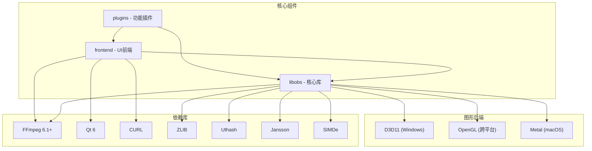

# OBS Studio 技术栈文档

## 1. 核心编程语言与框架

### 1.1 主要编程语言
- **C/C++**: 核心库和大部分插件的主要开发语言
- **Python**: 脚本支持（通过obspython插件）
- **LuaJIT**: 脚本支持（通过obslua插件）
- **Objective-C**: macOS平台特定功能（如cocoa.m文件）

### 1.2 图形框架
- **DirectX 11**: Windows平台图形渲染支持
- **OpenGL**: 跨平台图形渲染支持
- **Metal**: macOS平台图形渲染支持
- **WinRT**: Windows运行时支持

### 1.3 UI框架
- **Qt 6**: 主要UI框架，依赖以下模块：
  - Widgets: 基本UI组件
  - Network: 网络功能
  - Svg: 矢量图形支持
  - Xml: XML解析
  - (Linux/macOS) DBus: 桌面通信（Linux/macOS）
  - (Linux/macOS) Gui: 图形界面扩展（Linux/macOS）

## 2. 库依赖与工具链

### 2.1 核心库依赖
- **FFmpeg 6.1+**: 音视频处理核心库
  - avcodec: 编解码功能
  - avutil: 通用工具函数
  - avformat: 媒体格式处理
  - swscale: 视频缩放功能
  - swresample: 音频重采样
- **Qt 6**: UI框架
- **CURL**: 网络请求处理
- **ZLIB**: 数据压缩库
- **Uthash**: 哈希表实现
- **Jansson**: JSON解析库
- **SIMDe**: SIMD指令集抽象层
- **Threads**: 线程支持库

### 2.2 内置依赖库
- **blake2**: 密码学哈希函数
- **glad**: OpenGL加载库
- **json11**: JSON解析库
- **libcaption**: 字幕处理库
- **libdshowcapture**: DirectShow捕获支持
- **w32-pthreads**: Windows平台POSIX线程实现

### 2.3 构建工具
- **CMake 3.28+**: 跨平台构建系统
- **CMakePresets.json**: 预定义构建配置
- **C++17**: 使用的C++标准

## 3. API接口与技术标准

### 3.1 核心API接口
- **libobs**: 核心库，提供以下主要接口：
  - **Source API**: 源管理（输入、滤镜、转场、场景）
    - `obs_source_t`: 源对象
    - `obs_scene_t`: 场景对象
    - `obs_sceneitem_t`: 场景项对象
  - **Encoder API**: 编码器接口
    - `obs_encoder_t`: 编码器对象
    - 支持音频和视频编码
  - **Output API**: 输出接口
    - `obs_output_t`: 输出对象
  - **Service API**: 服务接口
    - `obs_service_t`: 服务对象
  - **Hotkey API**: 热键管理
    - `obs_hotkey_t`: 热键对象
  - **Audio Controls API**: 音频控制
    - `obs_fader_t`: 音频推子
    - `obs_volmeter_t`: 音量计

### 3.2 脚本API
- **Python API**: 通过obspython模块提供
- **LuaJIT API**: 通过obslua模块提供

### 3.3 媒体处理标准
- **H.264/AVC**: 视频编码标准
- **H.265/HEVC**: 高效视频编码标准（可选启用）
- **AV1**: 新一代视频编码标准（可选启用）
- **RTMP**: 实时消息协议，用于流媒体传输
- **WebRTC**: 网页实时通信协议（通过obs-webrtc插件）
- **WebSocket**: 提供远程控制接口（通过obs-websocket插件）

### 3.4 平台特定API
- **Windows**: 
  - DirectShow (DSHOW)
  - WASAPI
  - WinRT
  - D3D11
- **macOS**: 
  - CoreAudio
  - AVCapture
  - Syphon
  - VideoToolbox
  - Metal
- **Linux**: 
  - ALSA
  - PulseAudio
  - PipeWire
  - JACK
  - V4L2
  - X11
  - Wayland

## 4. 开发环境配置指南

### 4.1 Windows开发环境

#### 4.1.1 必要工具
- **Visual Studio 2022**（或更新版本）
- **CMake 3.28+**
- **Git**
- **Qt 6.x**
- **Python 3.x**（可选，用于脚本支持）

#### 4.1.2 构建步骤
```bash
# 克隆仓库（包括子模块）
git clone --recursive https://github.com/obsproject/obs-studio.git
cd obs-studio

# 创建构建目录
mkdir build && cd build

# 运行CMake配置
cmake .. -G "Visual Studio 17 2022" -A x64 -DCMAKE_PREFIX_PATH="C:/Qt/6.x/mingw_64"

# 编译项目
cmake --build . --config RelWithDebInfo
```

#### 4.1.3 Windows特定注意事项
- 确保安装DirectX SDK
- 对于Windows平台，需要安装额外的依赖包
- 使用CMakePresets.json中的预设可以简化配置过程

### 4.2 macOS开发环境

#### 4.2.1 必要工具
- **Xcode** 最新版本
- **CMake 3.28+**
- **Git**
- **Qt 6.x**
- **Homebrew**（用于安装依赖）

#### 4.2.2 构建步骤
```bash
# 安装必要的依赖
brew install ffmpeg x264 qt@6

# 克隆仓库
git clone --recursive https://github.com/obsproject/obs-studio.git
cd obs-studio

# 创建构建目录
mkdir build && cd build

# 运行CMake配置
cmake .. -DCMAKE_PREFIX_PATH="$(brew --prefix qt@6)"

# 编译项目
cmake --build . --config RelWithDebInfo
```

### 4.3 Linux开发环境

#### 4.3.1 必要工具
- **GCC 9+** 或 **Clang 10+**
- **CMake 3.28+**
- **Git**
- **Qt 6.x**
- **依赖开发包**（如libavcodec-dev等）

#### 4.3.2 构建步骤（Ubuntu/Debian示例）
```bash
# 安装基本依赖
sudo apt update
sudo apt install build-essential cmake git libqt6svg6-dev libqt6network6-dev libqt6xml6-dev libqt6widgets6-dev libqt6core5compat6-dev libqt6opengl6-dev libqt6dbus6-dev

# 安装媒体依赖
sudo apt install libavcodec-dev libavdevice-dev libavfilter-dev libavformat-dev libavutil-dev libswresample-dev libswscale-dev

# 安装其他依赖
sudo apt install libcurl4-openssl-dev libssl-dev libasound2-dev libpulse-dev libpipewire-0.3-dev libjack-dev libx11-dev libxcomposite-dev libxinerama-dev libxrandr-dev libxtst-dev libwayland-dev

# 克隆仓库
git clone --recursive https://github.com/obsproject/obs-studio.git
cd obs-studio

# 创建构建目录
mkdir build && cd build

# 运行CMake配置
cmake .. -DCMAKE_INSTALL_PREFIX=/usr

# 编译项目
cmake --build . --config RelWithDebInfo -j$(nproc)

# 安装
cd .. && sudo checkinstall --default --install=no
```

## 5. 关键组件与依赖关系

### 5.1 核心组件



### 5.2 主要插件与功能
- **obs-ffmpeg**: 提供FFmpeg相关功能，包括录制和转码
- **obs-x264**: H.264编码支持
- **obs-nvenc**: NVIDIA NVENC硬件编码支持
- **obs-qsv11**: Intel Quick Sync Video编码支持
- **obs-vst**: VST音频插件支持
- **obs-webrtc**: WebRTC流媒体支持
- **obs-websocket**: WebSocket远程控制支持
- **obs-browser**: 浏览器源支持
- **win-capture**: Windows捕获功能（窗口、游戏、显示器）
- **mac-avcapture**: macOS捕获功能
- **linux-capture**: Linux捕获功能
- **win-wasapi**: Windows音频捕获
- **linux-alsa/pulseaudio**: Linux音频捕获
- **coreaudio-encoder**: macOS音频编码

## 6. 学习资源推荐

### 6.1 官方资源
- **[OBS Studio 官方文档](https://obsproject.com/docs/)**: 包含用户指南和开发文档
- **[OBS Studio GitHub 仓库](https://github.com/obsproject/obs-studio)**: 源代码和问题跟踪
- **[OBS Plugin API 参考](https://obsproject.com/docs/reference-plugins.html)**: 插件开发API参考

### 6.2 开发教程
- **[OBS 插件开发教程](https://obsproject.com/docs/obs-plugins.html)**: 官方插件开发指南
- **[OBS Studio 脚本API](https://obsproject.com/docs/scripting.html)**: Python和Lua脚本开发文档
- **[OBS-Studio-Python-Scripting-Cheatsheet](https://github.com/obsproject/obs-studio/wiki/Scripting-Tutorial)**: Python脚本开发参考

### 6.3 视频教程
- **[OBS Studio 开发者会议](https://www.youtube.com/c/OBSProject/playlists)**: YouTube上的开发者会议录像
- **[Plugin Development Tutorials](https://www.youtube.com/results?search_query=obs+plugin+development)**: 第三方开发教程

### 6.4 社区资源
- **[OBS Studio 论坛](https://obsproject.com/forum/)**: 开发者和用户讨论
- **[Discord 社区](https://discord.gg/obsproject)**: 实时交流
- **[Stack Overflow OBS 标签](https://stackoverflow.com/questions/tagged/obs-studio)**: 技术问答

### 6.5 相关技术学习
- **[FFmpeg 文档](https://ffmpeg.org/documentation.html)**: 音视频处理库学习
- **[Qt 6 文档](https://doc.qt.io/qt-6/)**: UI框架学习
- **[CMake 教程](https://cmake.org/cmake/help/latest/guide/tutorial/index.html)**: 构建系统学习
- **[WebRTC 基础](https://webrtc.org/getting-started/overview)**: 实时通信技术

## 7. 插件开发指南

### 7.1 创建基础插件
```c
#include <obs-module.h>

OBS_DECLARE_MODULE()
OBS_MODULE_USE_DEFAULT_LOCALE("my-plugin", "en-US")

bool obs_module_load(void)
{
    // 注册源、滤镜或其他功能
    return true;
}

void obs_module_unload(void)
{
    // 清理资源
}
```

### 7.2 源插件示例
```c
struct my_source_data {
    obs_source_t *source;
    // 其他源数据
};

static const char *my_source_get_name(void *unused)
{
    return "My Source";
}

static void *my_source_create(obs_data_t *settings, obs_source_t *source)
{
    struct my_source_data *data = bzalloc(sizeof(struct my_source_data));
    data->source = source;
    // 初始化源
    return data;
}

static void my_source_destroy(void *data)
{
    // 清理资源
    bfree(data);
}

static obs_properties_t *my_source_get_properties(void *data)
{
    obs_properties_t *props = obs_properties_create();
    // 添加属性控件
    return props;
}

static void my_source_defaults(obs_data_t *defaults)
{
    // 设置默认值
}

static void my_source_update(void *data, obs_data_t *settings)
{
    // 更新设置
}

static void my_source_video_render(void *data, gs_effect_t *effect)
{
    // 渲染视频
}

struct obs_source_info my_source_info = {
    .id = "my_source",
    .type = OBS_SOURCE_TYPE_INPUT,
    .output_flags = OBS_SOURCE_VIDEO,
    .get_name = my_source_get_name,
    .create = my_source_create,
    .destroy = my_source_destroy,
    .get_properties = my_source_get_properties,
    .get_defaults = my_source_defaults,
    .update = my_source_update,
    .video_render = my_source_video_render,
};

bool obs_module_load(void)
{
    obs_register_source(&my_source_info);
    return true;
}
```

## 8. 技术栈总结

OBS Studio是一个功能强大的开源流媒体和录制软件，其技术栈涵盖了现代多媒体应用开发的各个方面：

- **多语言支持**: 主要使用C/C++，同时支持Python和Lua脚本扩展
- **跨平台设计**: 通过条件编译和平台特定实现支持Windows、macOS和Linux
- **强大的媒体处理**: 基于FFmpeg构建的音视频处理能力
- **可扩展架构**: 基于插件系统设计，允许功能扩展
- **现代图形API**: 支持多种图形渲染后端（D3D11、OpenGL、Metal）
- **灵活的UI框架**: 使用Qt 6提供一致的用户体验

通过这个全面的技术栈，OBS Studio能够提供专业级的视频录制和直播功能，同时保持良好的性能和用户体验。对于开发者而言，了解和掌握这个技术栈将有助于进行二次开发、插件创建和系统集成。