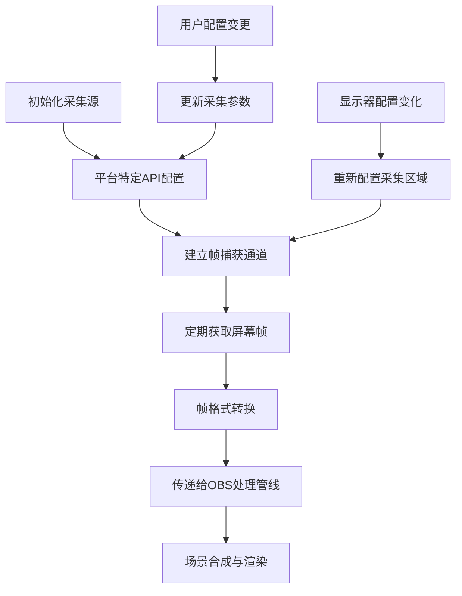

# 屏幕采集技术详解：OBS Studio实现原理与架构分析

## 1. 核心概念与技术背景

### 1.1 屏幕采集的基本概念

屏幕采集是指从操作系统的显示缓冲区或图形系统中获取屏幕内容的过程，是视频录制和直播应用的基础功能。在OBS Studio中，屏幕采集作为一个核心输入源类型，支持显示器捕获和窗口捕获两种主要模式。

### 1.2 多平台实现的必要性

不同操作系统采用不同的图形架构和API设计，因此OBS Studio需要为Windows、macOS和Linux分别实现平台特定的屏幕采集方案，以达到最佳性能和兼容性。

### 1.3 屏幕采集的关键挑战

- **性能开销**：高分辨率和高帧率下的高效采集
- **系统兼容性**：支持不同操作系统版本和硬件配置
- **DRM内容处理**：处理受保护内容的合理方式
- **动态分辨率适应**：支持分辨率变化和多显示器配置
- **GPU加速**：尽可能利用硬件加速减少CPU负担

## 2. 详细实现流程与关键步骤解析

### 2.1 整体架构设计

OBS Studio采用插件化架构，屏幕采集功能在各平台特定的插件中实现：

- Windows: `win-capture`插件
- macOS: `mac-capture`插件
- Linux: `linux-capture`插件

所有平台的采集插件都遵循OBS的源（Source）API接口规范，通过统一的接口向OBS核心提供视频数据。

### 2.2 屏幕采集的通用流程



### 2.3 平台特定实现流程

#### 2.3.1 Windows平台采集流程

1. **初始化Direct3D环境**：创建与图形系统的连接
2. **选择采集方法**：根据系统版本和用户配置选择WGC或GDI
3. **创建捕获会话**：建立与图形系统的持久连接
4. **帧池管理**：维护用于存储捕获帧的资源池
5. **帧处理循环**：持续从捕获源获取帧并进行处理

#### 2.3.2 macOS平台采集流程

1. **ScreenCaptureKit初始化**：在支持的系统上配置现代捕获框架
2. **捕获配置**：设置捕获区域、帧率和质量参数
3. **创建捕获流**：建立与系统图形服务器的连接
4. **帧接收处理**：通过委托模式接收屏幕帧
5. **色彩空间转换**：处理P3等高级色彩空间

#### 2.3.3 Linux平台采集流程

1. **X11连接建立**：连接到X服务器获取显示信息
2. **选择采集扩展**：根据系统支持选择XSHM或XComposite
3. **屏幕信息获取**：通过XRandR或Xinerama获取显示器配置
4. **共享内存设置**：为高效帧传输配置共享内存区域
5. **事件监听**：监听显示器配置变化事件

## 3. 关键技术点深度剖析

### 3.1 Windows平台实现细节

#### 3.1.1 Windows Graphics Capture (WGC) 实现

WGC是Windows 10 1803及更高版本提供的现代屏幕捕获API，具有高性能和系统级支持：

```c++
// WGC捕获初始化的核心步骤
GraphicsCaptureItem item = ...; // 从显示器或窗口获取
Direct3D11CaptureFramePool framePool = Direct3D11CaptureFramePool::Create(
    device,                   // Direct3D设备
    DirectXPixelFormat::B8G8R8A8UIntNormalized,  // 像素格式
    2,                        // 最大缓冲区数量
    item.Size());             // 初始尺寸
```

WGC的主要优势：
- 支持硬件加速捕获
- 能够捕获受DWM保护的内容
- 提供更高的采集效率和更低的系统开销
- 原生支持多显示器场景

#### 3.1.2 传统GDI捕获实现

对于不支持WGC的旧系统，OBS提供GDI捕获作为后备方案：

```c++
// GDI显示器捕获的关键实现
void capture_screen(HDC hdc, uint32_t cx, uint32_t cy, uint8_t *data) {
    HDC hdc_mem = CreateCompatibleDC(hdc);
    HBITMAP hbm = CreateCompatibleBitmap(hdc, cx, cy);
    
    SelectObject(hdc_mem, hbm);
    BitBlt(hdc_mem, 0, 0, cx, cy, hdc, 0, 0, SRCCOPY);
    
    // 提取位图数据到内存缓冲区
    GetBitmapBits(hbm, cx * cy * 4, data);
    
    // 清理资源
    DeleteObject(hbm);
    DeleteDC(hdc_mem);
}
```

### 3.2 macOS平台实现细节

#### 3.2.1 ScreenCaptureKit框架

在macOS 12及更高版本上，OBS使用ScreenCaptureKit框架实现高性能屏幕捕获：

```objective-c
// ScreenCaptureKit初始化关键代码
SCShareableContent *shareableContent = [SCShareableContent current];
SCScreenshotManager *screenshotManager = [[SCScreenshotManager alloc] initWithShareableContent:shareableContent];

// 配置捕获参数
SCCaptureConfiguration *config = [[SCCaptureConfiguration alloc] init];
config.display = targetDisplay;
config.capturesCursor = YES;
config.preservesAlphaChannel = YES;
config.minimumFrameInterval = CMTimeMake(1, 60); // 60fps
```

ScreenCaptureKit的关键特性：
- 支持高帧率（最高120fps）和高分辨率捕获
- 提供P3色彩空间支持
- 允许同时捕获音频
- 系统级支持，性能优异

### 3.3 Linux平台实现细节

#### 3.3.1 XSHM扩展捕获

X11共享内存扩展（XSHM）是Linux上实现高效屏幕捕获的关键技术：

```c
// XSHM捕获初始化核心代码
data->shminfo.shmid = shmget(IPC_PRIVATE, width * height * 4, IPC_CREAT | 0777);
data->shminfo.shmaddr = (char *)shmat(data->shminfo.shmid, 0, 0);
data->shminfo.readOnly = False;

// 关联共享内存到X服务器
XShmAttach(data->xcb, &data->shminfo);

// 创建共享内存图像
XShmCreateImage(data->xcb, data->visual, data->depth, ZPixmap, 
                data->shminfo.shmaddr, &data->shminfo, width, height);
```

XSHM捕获的关键机制：
- 通过共享内存减少数据复制开销
- 支持XRandR扩展监听显示变化
- 提供Xinerama支持以处理多显示器配置

#### 3.3.2 XComposite窗口捕获

对于窗口捕获，Linux平台使用XComposite扩展：

```c
// XComposite窗口捕获的关键流程
void *xcomp_capture_texture(void *data, uint32_t cx, uint32_t cy) {
    struct xcompcap *s = data;
    xcb_get_image_reply_t *reply;
    
    // 使用XComposite获取窗口内容
    reply = xcb_get_image_reply(s->conn, 
             xcb_get_image_unchecked(s->conn, XCB_IMAGE_FORMAT_Z_PIXMAP, 
             s->window, 0, 0, cx, cy, ~0), NULL);
    
    // 处理图像数据并创建纹理
    // ...
    
    free(reply);
    return texture;
}
```

## 4. 常见问题诊断与解决方案

### 4.1 Windows平台问题

#### 4.1.1 黑屏或无法捕获问题

**症状**：捕获区域显示为黑色或灰屏。

**可能原因**：
- 安全策略限制WGC访问
- 图形驱动程序不兼容
- 应用程序使用了特殊的渲染技术

**解决方案**：
```c
// 检查WGC可用性的代码
if (!IsWindows10OrGreater(1803, 0)) {
    // 使用GDI作为后备
    use_gdi_capture = true;
}
```

配置调整：
- 在OBS设置中尝试切换到GDI捕获
- 更新显卡驱动程序到最新版本
- 检查Windows安全设置中的屏幕捕获权限

#### 4.1.2 高帧率下的性能问题

**症状**：在高分辨率、高帧率下CPU使用率过高。

**解决方案**：
- 确认启用了硬件加速（在高级设置中）
- 考虑降低捕获分辨率或帧率
- 关闭不必要的UI元素或效果

### 4.2 macOS平台问题

#### 4.2.1 权限问题

**症状**：无法启动捕获或应用崩溃。

**解决方案**：
- 在系统偏好设置中授予OBS屏幕录制权限
- 完全退出OBS并重新启动
- 检查隐私设置中的辅助功能权限

#### 4.2.2 色彩不正确

**症状**：捕获的颜色与实际显示不一致。

**配置调整**：
```objective-c
// 正确设置色彩空间转换
CGColorSpaceRef colorSpace = CGColorSpaceCreateWithName(kCGColorSpaceSRGB);
if (!colorSpace) {
    colorSpace = CGColorSpaceCreateDeviceRGB();
}

// 配置颜色转换上下文
vImage_CGImageFormat sourceFormat = {
    .bitsPerComponent = 8,
    .bitsPerPixel = 32,
    .colorSpace = colorSpace,
    // 其他参数...
};
```

### 4.3 Linux平台问题

#### 4.3.1 X11扩展支持问题

**症状**：无法检测到显示器或捕获质量差。

**诊断方法**：
```bash
# 检查X11扩展支持
xrandr --listmonitors  # 检查XRandR支持
xdpyinfo | grep -i xinerama  # 检查Xinerama支持
xprop -root | grep _NET_CLIENT_LIST  # 检查EWMH支持
```

**解决方案**：
- 安装缺失的X11扩展包
- 配置窗口管理器以支持所需扩展
- 尝试切换到不同的窗口管理器

#### 4.3.2 窗口管理器兼容性问题

**症状**：窗口捕获不稳定或不工作。

**配置调整**：
```c
// 窗口管理器兼容性检查
if (!xcomp_check_ewmh(conn, screen_default->root)) {
    blog(LOG_WARNING, "窗口管理器不支持Extended Window Manager Hints (EWMH)");
    blog(LOG_WARNING, "XComposite捕获已禁用");
    return false;
}
```

## 5. 性能评估指标与优化建议

### 5.1 关键性能指标

- **CPU使用率**：屏幕采集过程中的处理器占用
- **延迟**：从屏幕内容变化到出现在OBS中的时间差
- **内存使用**：采集过程中消耗的系统内存
- **GPU资源**：图形处理单元的利用率
- **帧率稳定性**：采集帧率的波动程度

### 5.2 各平台性能优化策略

#### 5.2.1 Windows平台优化

1. **优先使用WGC**：在支持的系统上，WGC比GDI提供更好的性能
2. **合理设置捕获区域**：仅捕获需要的屏幕部分
3. **禁用不必要的功能**：如光标捕获（如果不需要）
4. **启用硬件加速**：确保DirectX功能正常工作

```c++
// WGC捕获的优化参数
framePool = Direct3D11CaptureFramePool::Create(
    device,
    DirectXPixelFormat::B8G8R8A8UIntNormalized,
    2,  // 最小化缓冲区数量以减少内存使用
    item.Size());
```

#### 5.2.2 macOS平台优化

1. **使用ScreenCaptureKit**：在macOS 12+上利用现代API
2. **合理配置帧率**：根据需要设置适当的采集帧率
3. **利用硬件编码**：结合硬件编码提高整体性能

```objective-c
// 帧率优化配置
config.minimumFrameInterval = CMTimeMake(1, 30);  // 对一般应用降低到30fps

// 对于游戏或高动作内容
// config.minimumFrameInterval = CMTimeMake(1, 60);
```

#### 5.2.3 Linux平台优化

1. **使用XSHM扩展**：确保启用共享内存捕获
2. **优化X11设置**：调整X服务器配置以提高性能
3. **减少颜色深度**：在不需要高色彩质量时使用较低的位深度

```c
// 共享内存性能优化
// 使用最小必要的缓冲区数量
if (data->buffer_count > 2) {
    data->buffer_count = 2;
}

// 仅在需要时复制数据
if (!memcmp(data->current_buffer, new_data, data->buffer_size)) {
    // 数据未变化，避免不必要的处理
    return;
}
```

### 5.3 跨平台通用优化建议

1. **分辨率适配**：在OBS中使用缩放而非原始分辨率捕获
2. **帧率控制**：根据实际需求设置合适的捕获帧率
3. **多线程处理**：使用专门的线程处理捕获和转换
4. **缓冲区管理**：实现高效的缓冲区重用机制
5. **事件驱动更新**：在可能的情况下使用事件驱动模式而非轮询

## 6. 总结与最佳实践

### 6.1 平台选择建议

- **Windows**: 优先使用WGC（适用于Windows 10 1803及更高版本）
- **macOS**: 使用ScreenCaptureKit（适用于macOS 12及更高版本）
- **Linux**: 使用XSHM显示器捕获和XComposite窗口捕获

### 6.2 开发与扩展指南

当为OBS开发自定义屏幕采集插件或扩展现有功能时，应遵循以下原则：

1. **保持与OBS核心API的兼容性**
2. **实现适当的错误处理和回退机制**
3. **考虑性能影响，避免不必要的数据复制**
4. **处理显示配置变化的事件**
5. **提供清晰的用户配置选项**

### 6.3 未来发展方向

- **更广泛的硬件加速支持**：利用GPU直接捕获能力
- **更高色彩深度支持**：支持HDR和更高位深度的内容
- **更低延迟的采集方式**：减少从屏幕到编码的延迟
- **更智能的资源管理**：根据系统负载动态调整采集参数

## 附录：参考资料

1. [Microsoft Windows Graphics Capture API文档](https://docs.microsoft.com/en-us/uwp/api/windows.graphics.capture)
2. [Apple ScreenCaptureKit文档](https://developer.apple.com/documentation/screencapturekit)
3. [X11扩展文档](https://www.x.org/releases/X11R7.7/doc/)
4. [OBS Studio源码](https://github.com/obsproject/obs-studio)
5. [Direct3D 11文档](https://docs.microsoft.com/en-us/windows/win32/direct3d11/)
